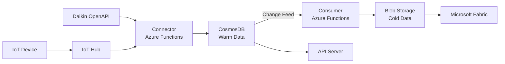

# Building OS バックエンド

> .NET 8.0 ベースのバックエンドシステム

Building OS のバックエンドは、Azure Functions による IoT データ処理と、ASP.NET Core による REST API で構成されています。

## 📁 プロジェクト構成

```
DotNet/
├── BuildingOS.ApiServer/       # REST API サーバー
├── BuildingOS.Functions/       # Connector/Consumer (Azure Functions)
├── BuildingOS.Functions.Test/  # Functions のテストプロジェクト
├── BuildingOS.Shared/          # 共有ライブラリ
├── BuildingOS.sln              # Visual Studio ソリューション
└── README.md
```

### プロジェクト一覧

| プロジェクト名                | フレームワーク                    | 説明                                       |
| ----------------------------- | --------------------------------- | ------------------------------------------ |
| **BuildingOS.ApiServer**      | ASP.NET Core 8.0                  | REST API サーバー                          |
| **BuildingOS.Functions**      | Azure Functions (Isolated Worker) | IoT データ処理（Connector/Consumer）       |
| **BuildingOS.Functions.Test** | xUnit                             | Functions の単体テスト                     |
| **BuildingOS.Shared**         | .NET 8.0                          | 共有ライブラリ（エンティティ、ヘルパー等） |

## 🚀 技術スタック

### フレームワーク

- **.NET 8.0**: 最新の .NET ランタイム
- **ASP.NET Core 8.0**: Web API フレームワーク
- **Azure Functions (Isolated Worker Model)**: サーバーレス実行環境

### Azure サービス

- **Azure IoT Hub**: IoT デバイス接続
- **Azure Event Hub**: イベントストリーミング
- **Azure CosmosDB**: NoSQL データベース
- **Azure Digital Twins**: デジタルツインモデル
- **Azure Blob Storage**: ファイルストレージ
- **Azure Application Insights**: アプリケーション監視

### 主要ライブラリ

- **Microsoft.Azure.Cosmos**: CosmosDB SDK
- **Azure.DigitalTwins.Core**: Digital Twins SDK
- **Corvus.Json.ExtendedTypes**: JSON Schema バリデーション
- **Swashbuckle.AspNetCore**: Swagger/OpenAPI

## 🛠️ 環境構築

### 前提条件

- [.NET SDK 8.0](https://dotnet.microsoft.com/ja-jp/download/dotnet/8.0)
- Visual Studio 2022 / Rider / VS Code
- Azure Functions Core Tools v4
- Docker Desktop（ローカル開発用）

### .NET SDK のインストール

```bash
# SDK のバージョン確認
dotnet --version

# 8.0 以上であることを確認
```

### IDE への Azure プラグインのインストール

| IDE                    | プラグイン                                                                                          |
| ---------------------- | --------------------------------------------------------------------------------------------------- |
| **Visual Studio 2022** | Azure 開発ワークロード（Visual Studio Installer）                                                   |
| **Visual Studio Code** | [Azure Tools](https://marketplace.visualstudio.com/items?itemName=ms-vscode.vscode-node-azure-pack) |
| **Rider**              | [Azure Toolkit for Rider](https://plugins.jetbrains.com/plugin/11220-azure-toolkit-for-rider)       |

### 依存関係の復元

```bash
cd DotNet
dotnet restore
```

## 🏃 ローカル実行

### アーキテクチャ

ローカル開発では、以下の構成でシステムを動作させます：

- **Functions**: ローカルの Azure Functions エミュレータで実行
- **API Server**: ローカルの Kestrel で実行
- **IoT Hub, Digital Twins, CosmosDB**: Azure の本番/開発環境に接続

### Functions の起動

```bash
cd BuildingOS.Functions
func start
```

または、IDE のデバッグ機能を使用します。

### API Server の起動

```bash
cd BuildingOS.ApiServer
dotnet run --launch-profile WithLocal
```

## 🧪 テスト

```bash
cd DotNet
dotnet test
```

詳細は [BuildingOS.Functions.Test/README.md](BuildingOS.Functions.Test/README.md) を参照してください。

## 📦 プロジェクト詳細

各プロジェクトの詳細は、それぞれの README を参照してください。

- [BuildingOS.ApiServer/README.md](BuildingOS.ApiServer/README.md) — REST API サーバー
- [BuildingOS.Functions/README.md](BuildingOS.Functions/README.md) — Connector/Consumer (Azure Functions)

## 📊 データフロー



### Connector の役割

1. IoT Hub または外部 API からメッセージを受信
2. メッセージの検証・変換
3. CosmosDB へ保存

### Consumer の役割

1. CosmosDB Change Feed でメッセージを受信
2. Blob Storage（コールドデータ）へ保存

### API Server の役割

1. CosmosDB からテレメトリデータ取得
2. Digital Twins からメタデータ取得
3. REST API 経由で配信

## 🔒 セキュリティ

### Managed Identity

Azure リソースへのアクセスには Managed Identity を使用。

```csharp
var credential = new DefaultAzureCredential();
var client = new DigitalTwinsClient(
    new Uri(endpoint),
    credential
);
```

### 認証

- **開発環境**: Basic 認証（テスト用）
- **本番環境**: Azure AD 認証

## 📚 参考資料

### .NET / C#

- [.NET ドキュメント](https://learn.microsoft.com/ja-jp/dotnet/)
- [ASP.NET Core ドキュメント](https://learn.microsoft.com/ja-jp/aspnet/core/)
- [Azure Functions .NET ドキュメント](https://learn.microsoft.com/ja-jp/azure/azure-functions/functions-dotnet-class-library)

### Azure SDK

- [Azure SDK for .NET](https://azure.github.io/azure-sdk-for-net/)
- [Azure Digital Twins SDK](https://learn.microsoft.com/ja-jp/dotnet/api/overview/azure/digitaltwins.core-readme)
- [Azure Cosmos DB SDK](https://learn.microsoft.com/ja-jp/azure/cosmos-db/nosql/sdk-dotnet-v3)

### ライブラリ

- [Corvus.Json.ExtendedTypes](https://github.com/corvus-dotnet/Corvus.JsonSchema)

## 🤝 コントリビューション

Pull Request を歓迎します。以下のガイドラインに従ってください：

1. コーディング規約: Microsoft の C# コーディング規約
2. テストの追加: 新機能には必ずテストを追加
3. ドキュメント: 公開 API には XML ドキュメントコメントを記載
