# Building OS Load Test System - Architecture Design

## 1. システム全体構成図

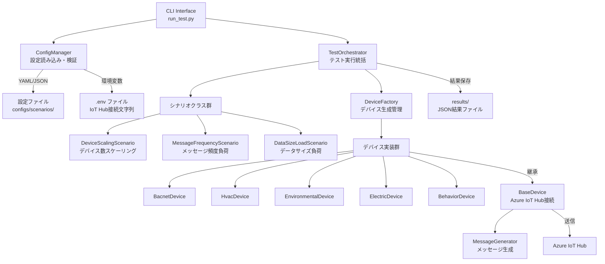

## 2. 処理フロー詳細図

### 2.1 メイン処理フロー

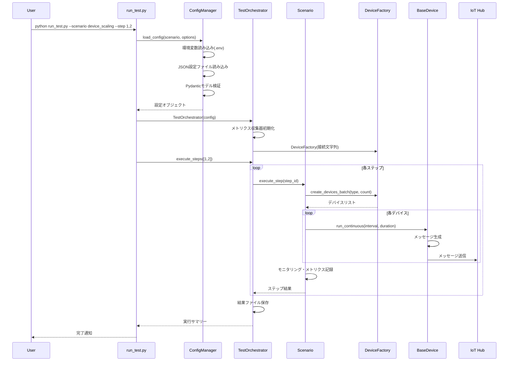

### 2.2 デバイスライフサイクル

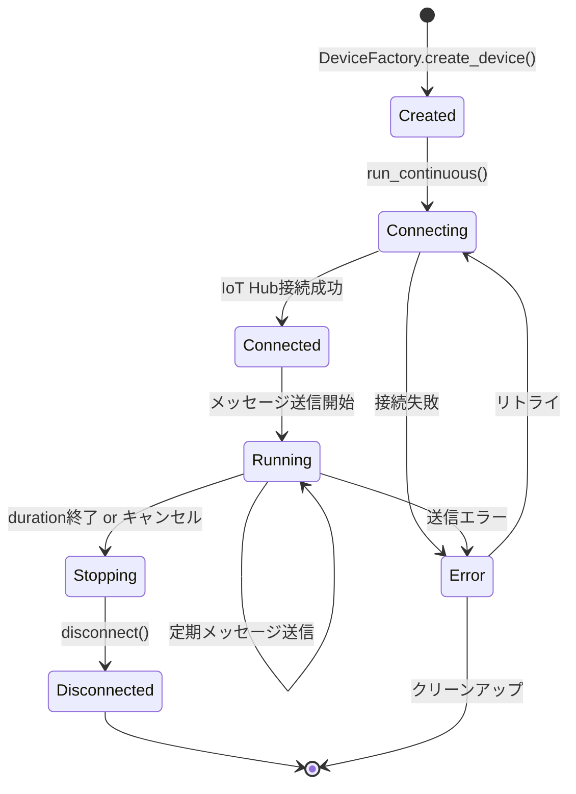

## 3. クラス構成図

### 3.1 コアモジュール設計

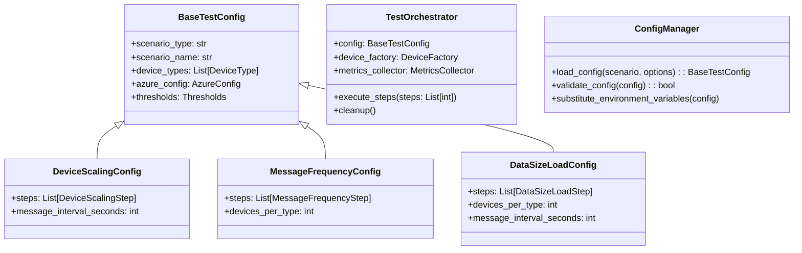

### 3.2 デバイス階層構造

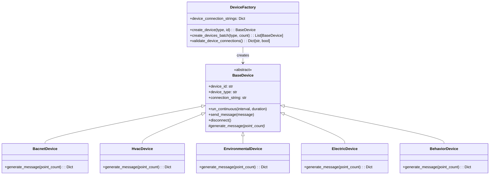

### 3.3 シナリオ実行フロー

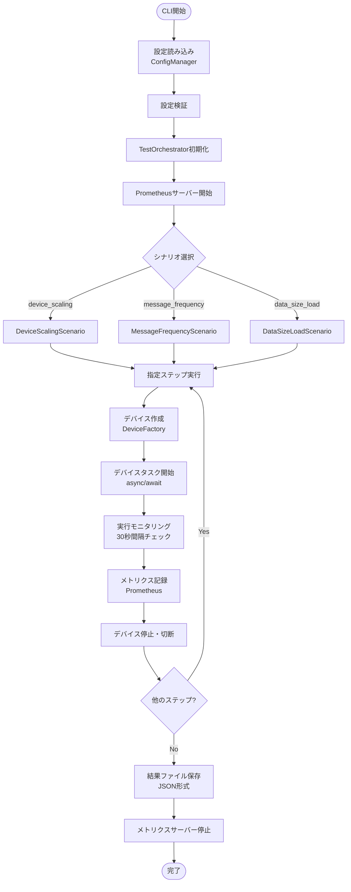

## 4. データフロー図

### 4.1 メッセージ生成・送信フロー

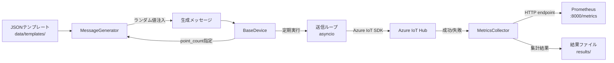

### 4.2 設定データフロー

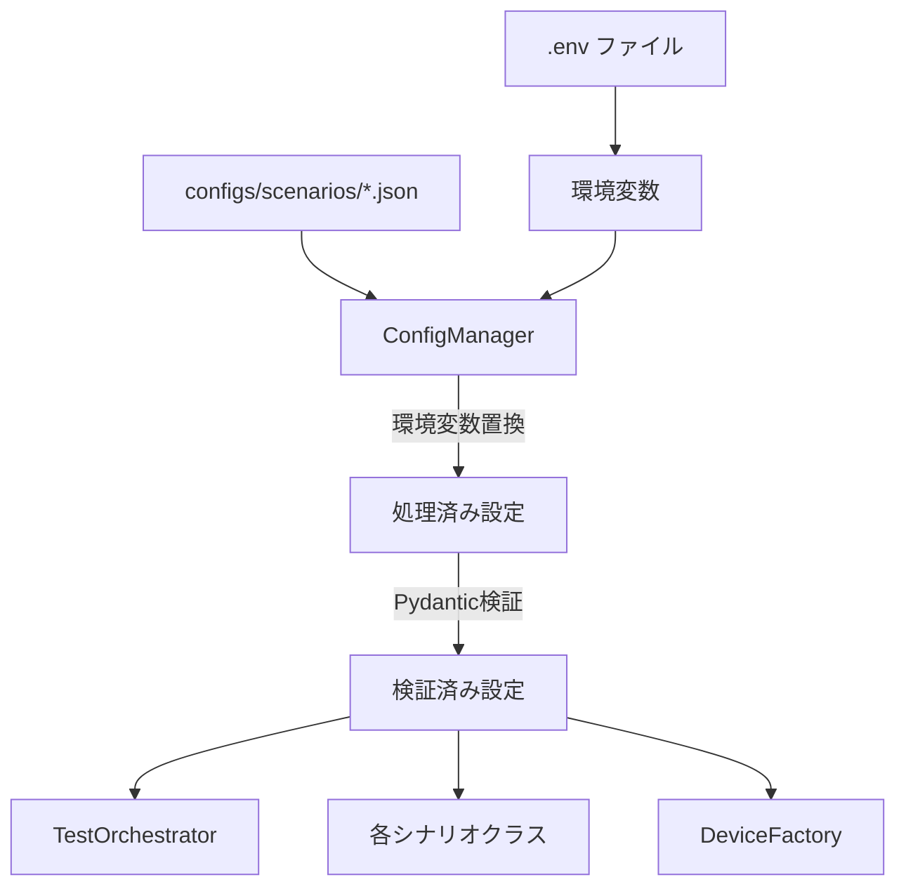

## 5. コンポーネント責務

| コンポーネント       | 責務                                              |
| -------------------- | ------------------------------------------------- |
| **run_test.py**      | CLI インターフェース、引数解析、メイン実行制御    |
| **ConfigManager**    | 設定ファイル読み込み、環境変数置換、Pydantic 検証 |
| **TestOrchestrator** | テスト実行統括、シナリオ選択、結果集約            |
| **シナリオクラス**   | 各負荷パターンの実行ロジック、ステップ制御        |
| **DeviceFactory**    | デバイスインスタンス生成、接続文字列管理          |
| **BaseDevice**       | IoT Hub 接続、メッセージ送信、ライフサイクル管理  |
| **MessageGenerator** | デバイス別メッセージ生成、テンプレート処理        |
| **MetricsCollector** | Prometheus メトリクス収集、HTTP Server 管理       |

## 6. 非同期処理設計

### 6.1 並行実行パターン

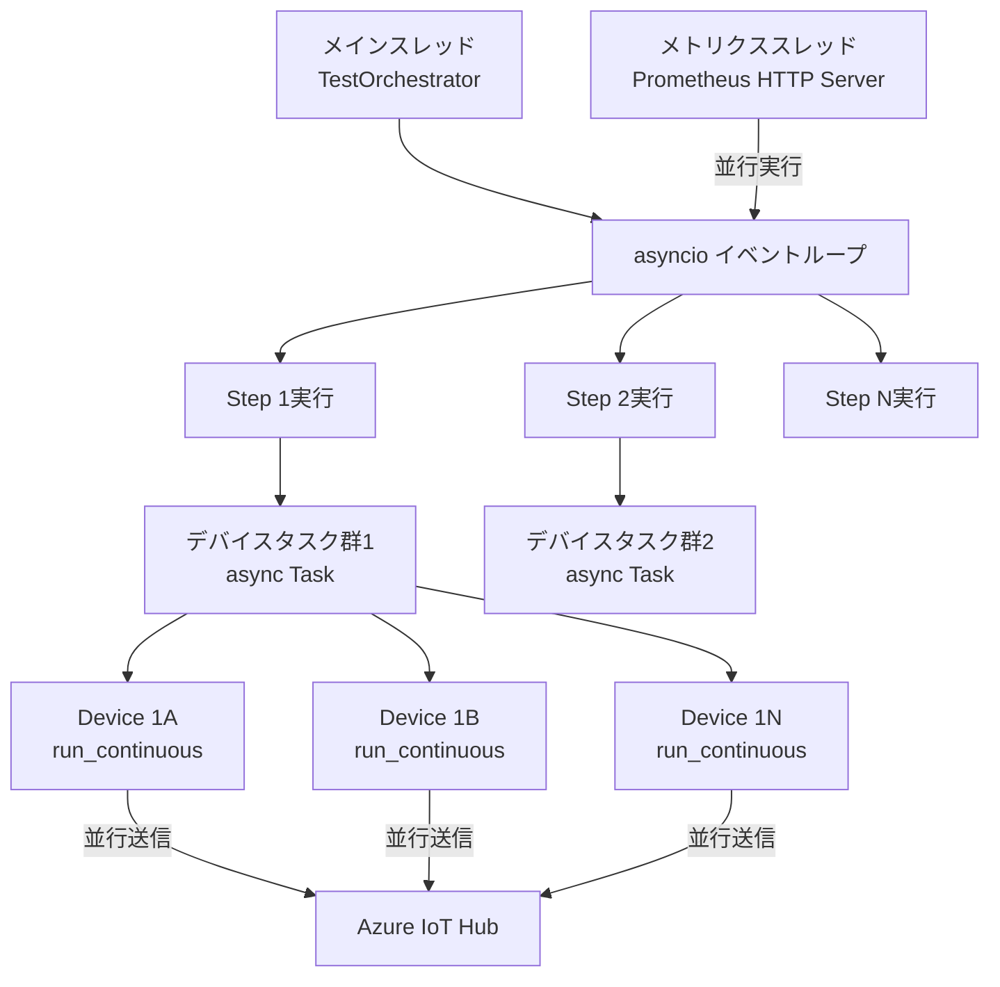

### 6.2 リソース管理

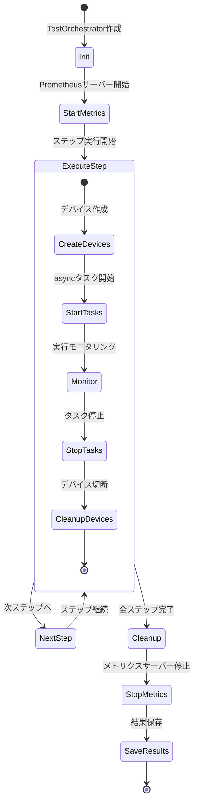

## 7. 設定システム設計

### 7.1 設定階層構造

```
configs/
├── default.env                    # 環境変数テンプレート
├── scenarios/                     # シナリオ別設定
│   ├── device_scaling.json       # デバイススケーリング設定
│   ├── message_frequency.json    # メッセージ頻度設定
│   └── data_size_load.json       # データサイズ負荷設定
└── custom/                       # カスタム設定（ユーザー作成）
```

### 7.2 設定マージフロー

```mermaid
flowchart TD
    DefaultConfig[デフォルト設定<br/>scenarios/*.json] --> EnvSubst[環境変数置換<br/>${VAR_NAME}]
    EnvFile[.env] --> EnvSubst

    EnvSubst --> CLIOverride[CLI引数オーバーライド<br/>--device-types, --duration]
    CLIOverride --> JSONOverride[JSON文字列オーバーライド<br/>--config-override]

    JSONOverride --> PydanticValidation[Pydantic型検証]
    PydanticValidation --> FinalConfig[最終設定オブジェクト]
```

## 8. メトリクスシステム設計

### 8.1 メトリクス種別

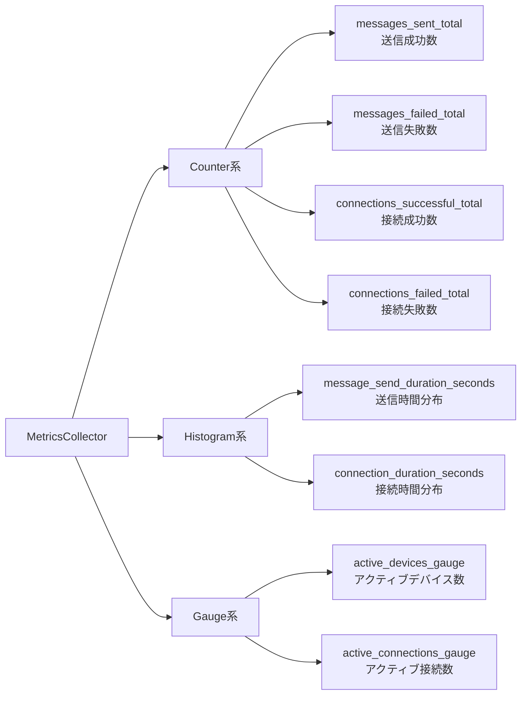

### 8.2 メトリクス収集フロー

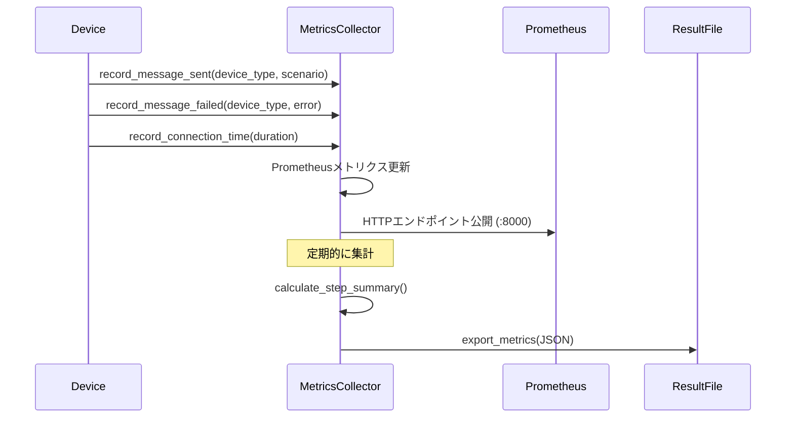

## 9. エラーハンドリング設計

### 9.1 エラー分類・対応

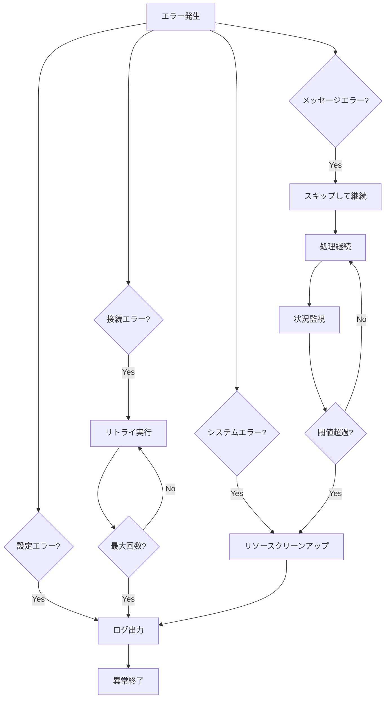

## 10. パフォーマンス考慮事項

### 10.1 スケーラビリティ設計

- **非同期処理**: asyncio による並行デバイス実行
- **メモリ効率**: デバイスプール管理、ステップ毎のリソース解放
- **スロットリング**: asyncio-throttle による送信レート制御
- **メトリクス最適化**: Prometheus pull 型メトリクス、HTTP Server 分離

### 10.2 負荷分散

```
Step 1: 100 devices  → 各タイプ 34 devices
Step 2: 500 devices  → 各タイプ 125 devices
Step 3: 1000 devices → 各タイプ 200 devices
Step 4: 2000 devices → 各タイプ 400 devices
```

各ステップは独立実行され、前ステップのリソースを完全にクリーンアップしてから次ステップを開始。
