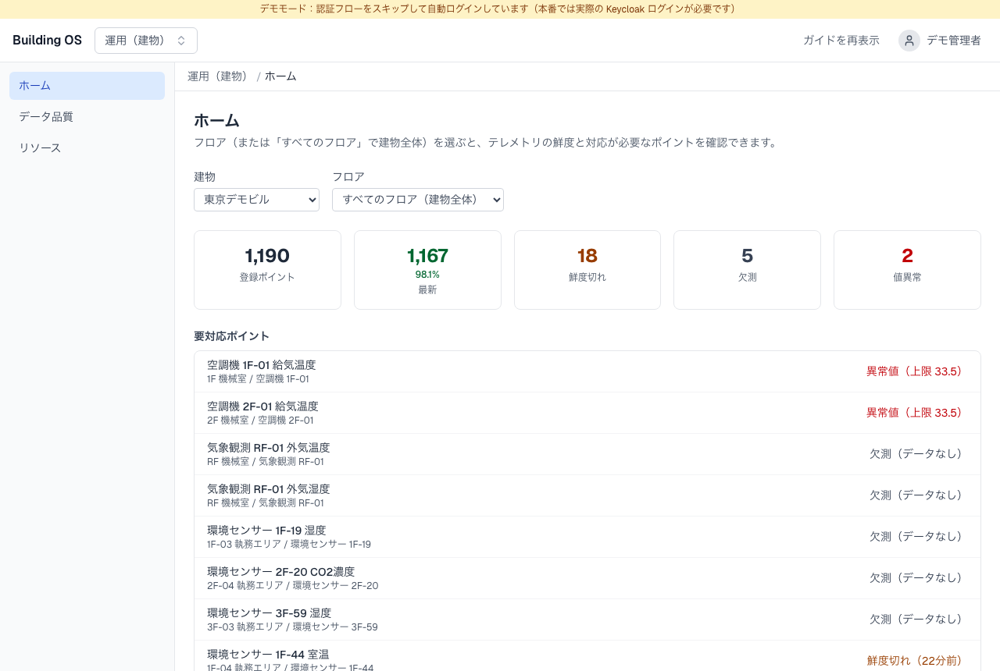
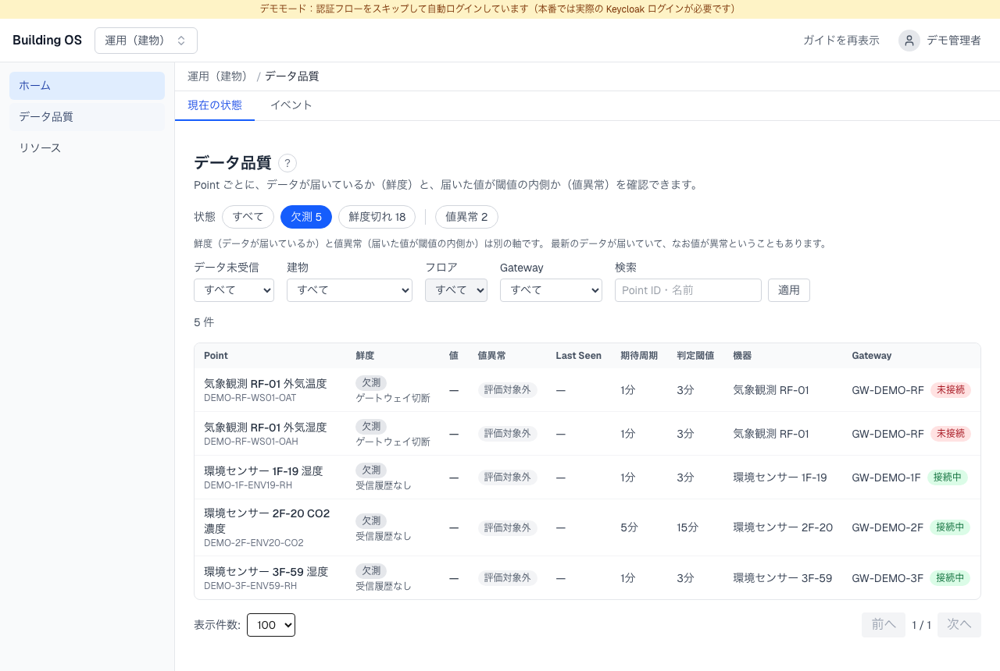
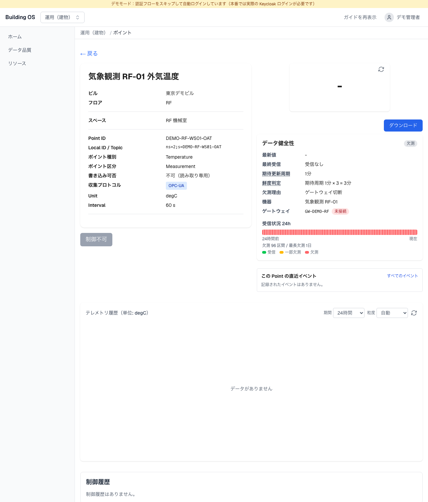
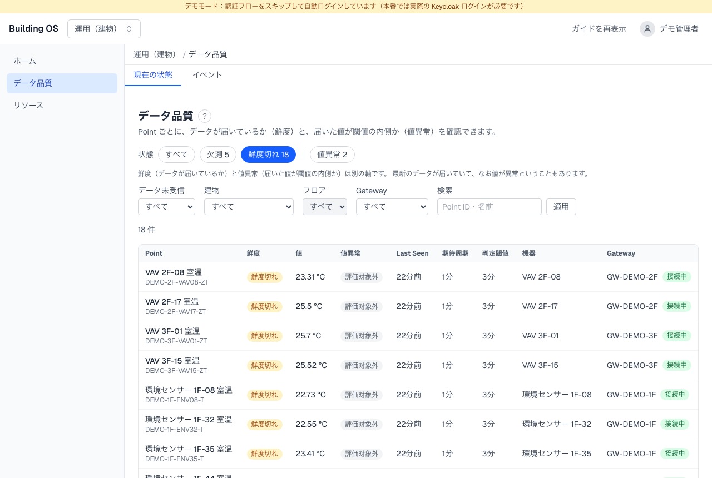
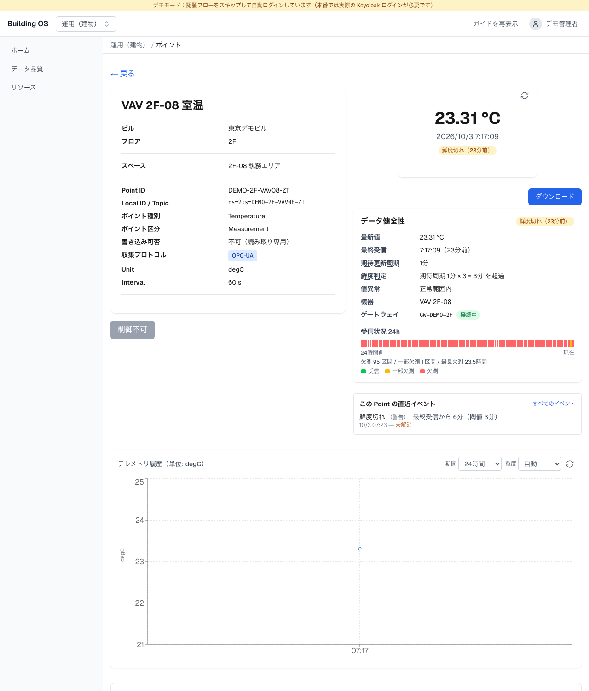
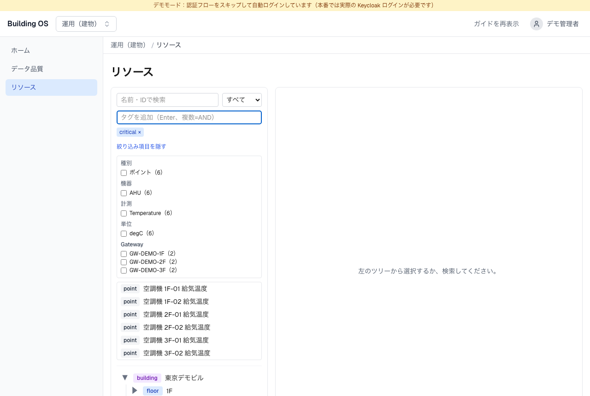
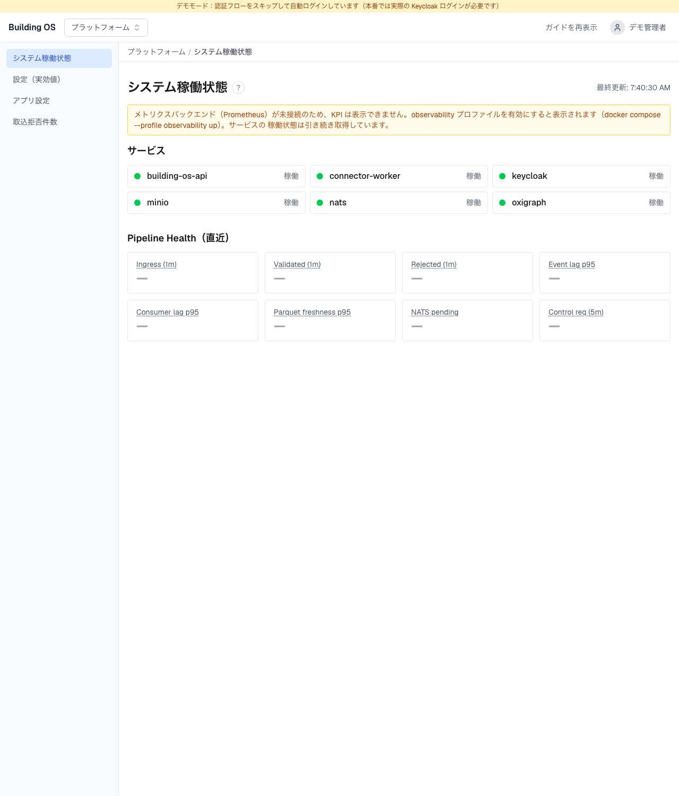
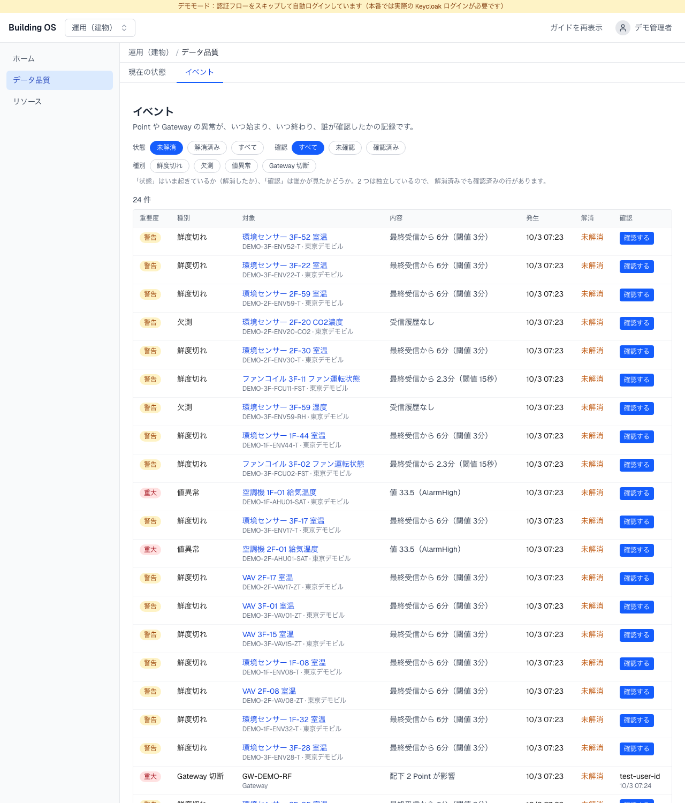
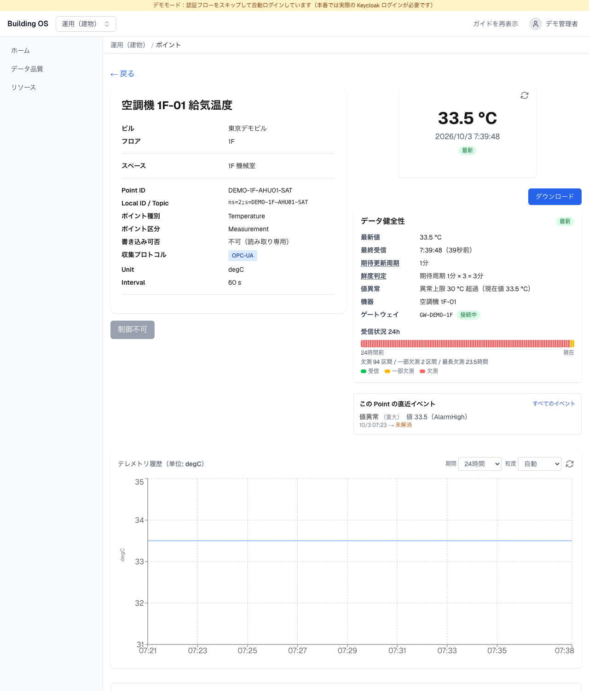
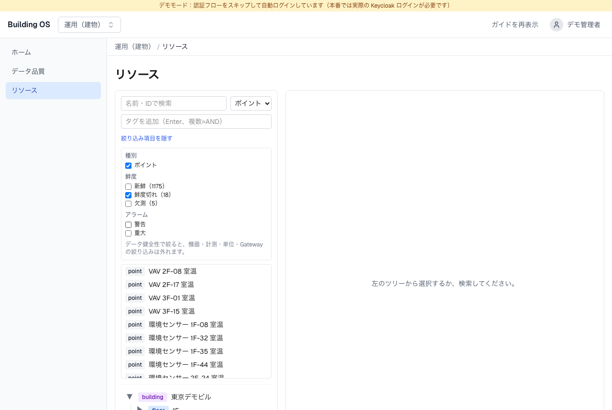

# 5 分デモ台本 — 異常の発見から原因の確認まで（#458）

`make demo` を起動すると、生成済みのデモデータセット（東京デモビル、約 1,200 Point）に、
**鮮度切れ・欠測・値異常が意図的に入った状態**でテレメトリが流れます。この台本は、Building OS の
中核価値である「異常を見つけて原因まで追う」流れを、本番と同じ UI だけで 5 分で見せるためのものです。
デモ専用の画面はありません。

## 準備

```bash
make demo
# → http://localhost:3000（デモモード: 自動ログイン）
```

起動から 1〜2 分で、次の状態になります（`DEMO_SCENARIO=degraded`、既定）。

| 区分 | 件数 | 作り方 |
|---|---|---|
| 登録ポイント | 1,190（東京デモビル）+ 8（制御デモ用の E2E Demo Building） | `fixtures/demo/manifest.toml` から生成 |
| 鮮度切れ | 18 | 起動時に「期待周期 × 4」だけ過去の時刻で 1 回だけ送り、その後は送らない。閾値は「期待周期 × 3」なので、起動直後から鮮度切れになる |
| 欠測 | 5 | 3 点は一度も送らない。残り 2 点は `GW-DEMO-RF`（屋上の気象観測）配下で、この gateway は egress 接続も張らない（= gateway 切断） |
| 値異常 | 2 | 空調機の給気温度に、上限（`alarmHigh` 30 ℃）を超える 33.5 ℃ を送り続ける |

全 Point を正常にしたい場合は `DEMO_SCENARIO=healthy make demo` を使います。

> **Platform 画面の KPI（手順 7）を見せる場合**は、observability プロファイルを足して起動してください:
> `docker compose -f docker-compose.oss.yaml -f docker-compose.demo.yaml --profile demo --profile webclient --profile observability up -d --build`
>
> 鮮度切れを作るために過去の時刻のデータを 1 回送るため、`building_os.ingress.event_lag`
> （#443、Platform 画面の Event lag）が起動直後に大きな値として跳ねます。デモではこれが正常です。

> **以前の `make demo` の twin が残っている場合:** 起動時シードは OxiGraph が空のときだけ取り込みます
> （#484）。旧データセット（8 Point）のままなら、`/admin/twin` から `fixtures/demo/twin.ttl` を
> **replace** でアップロードしてください。twin に無い Point を送っている間、feeder のログ
> （`docker logs building-os.demo-feeder`）に `HINT` が出ます。

## 台本（10 ステップ）

### 1. ホームで全体を見る（`/home`）

建物「東京デモビル」とフロア「すべてのフロア（建物全体）」を選びます。上段のカードで、登録 Point 数、
最新率、鮮度切れ・欠測・値異常の件数がひと目で分かります。下の「要対応ポイント」には、値異常、欠測、
鮮度切れの順に並びます。



### 2. 欠測カードから絞り込み一覧へ（`/health?freshness=missing`）

「欠測」カードをクリックすると、データ品質画面に欠測の Point だけが並びます。フィルタは URL に
入っているので、この状態をそのまま共有できます。屋上の 2 点は gateway 列が「切断」になっており、
欠測理由が gateway 切断だと分かります。



### 3. 欠測 Point の詳細（gateway 切断）

`気象観測 RF-01 外気温度` を開きます。「データ健全性」パネルに、欠測（受信なし）であること、
欠測理由「ゲートウェイ切断」、所属ゲートウェイ `GW-DEMO-RF` が「未接続」であることが出ます。
次に見るべきは Point ではなくゲートウェイだと、この画面だけで分かります。



### 4. 鮮度切れの一覧（`/health?freshness=stale`）

鮮度切れで絞り込むと 18 点が並びます。最終受信からの経過時間と閾値が列に出ています。



### 5. 鮮度切れ Point の詳細（なぜ鮮度切れか）

一覧から 1 点を開きます。「データ健全性」パネルに「期待周期 1 分 × 3 = 3 分 を超過」と、判定の
根拠（期待周期 × 倍率）が出ます。Point ごとの期待周期（`sbco:interval`）で判定しているので、
5 秒周期の運転状態と 30 分周期の電力量が同じ基準で並んでも誤判定しません。



### 6. タグで横断検索（`/resources`）

リソース画面のタグ欄に `critical` を入れて Enter を押します。空調機の給気温度 6 点だけが出ます。
タグは運用上の意味（重要監視、テナント、省エネ対象、要保守）を表し、フロアのような構造情報は
twin の階層で表すのでタグには入れません。デモには `critical` / `tenant-a` / `energy-saving-target` /
`maintenance-required` が入っています。



### 7. パイプラインの状態（`/platform/status`）

プラットフォーム画面で、各サービスの稼働状態と、取り込み流量・拒否件数・遅延などの Pipeline Health を
確認します。KPI を表示するには、上の「準備」にある observability プロファイルが必要です。



### 8. 異常の履歴と確認応答（`/health?view=events`）

「データ品質」の「イベント」タブには、いまの状態ではなく**異常がいつ始まり、いつ終わり、誰が確認したか**が
残ります。起動から 3 分ほどで、評価器が連続 2 回のスキャン（1 分周期）で条件を確かめたものを発生させます。
既定は未解消のイベントで、上の 4 種類（鮮度切れ 18・欠測 3・値異常 2・Gateway 切断 1）が並びます。

- 屋上の `GW-DEMO-RF` が切れているとき、配下 2 点の欠測は Point ごとのイベントにならず、**「Gateway 切断」
  1 件に集約**されます（gateway 断で数百 Point が一斉に欠測しても、画面が埋まらないように）。そのぶん
  欠測は 5 件ではなく 3 件に見えます。
- 「確認する」を押すと、確認した人と時刻が記録されます（操作できるのは operator と admin。最初に確認した人が
  残り、2 回押しても変わりません）。
- 「状態」（未解消 / 解消済み）と「確認」（未確認 / 確認済み）は**別の絞り込み**です。解消したあとで確認する
  こともできるので、2 つを 1 本の状態にはしていません。



### 9. Point 詳細の直近イベント

値異常（上限超過）のイベントから Point を開くと、「データ健全性」の下に**「この Point の直近イベント」**が
あります。いまの判定の根拠（上）と、過去に何が起きたか（下）が同じ画面で読めます。



### 10. 異常な Point を横断して探す（`/resources`）

リソース画面で種別を「ポイント」にすると、機器・計測・単位・Gateway に加えて**鮮度（新鮮 / 鮮度切れ /
欠測）とアラーム**で絞り込めます。「鮮度切れ」を選ぶと、18 点が出ます。鮮度・アラームは判定を持つ
データ品質 API で、機器・計測などの属性はツインの検索で答えるため、両方を同時には使えません
（片方を選ぶともう片方が外れます）。条件は URL に入るので、そのまま共有できます。



## データセットの仕組み

- **正本は `fixtures/demo/manifest.toml` だけ**です。`twin.ttl` / `pointlist.csv` / `feeder-plan.json`
  は `python3 Tools/demo-fixture-generator/generate.py` で生成します。乱数の seed を固定しているので、
  何度生成してもバイト単位で同じ結果になります。PR では `Demo Fixture Check` が再生成して差分を検査します。
- 生成された `twin.ttl` には、既存の `fixtures/e2e/twin.ttl`（`GW-SOS-001` / `SOS-PT-001..008`）を
  そのまま同梱しています。制御デモ、`make demo-e2e`、月次の demo-smoke は従来の Point で動きます。
- feeder（`Tools/development-edge-device/grpc_demo_feeder.py`）は Point ごとの期待周期で送ります。
  全体で約 25 frame/s（5 秒周期の Point は 51 点）で、既存の soak（#297、1,865 Point）より軽い負荷です。
  gateway ごとに GatewayBridge へ egress ストリームを張るので、gateway は「接続」と表示されます。
- 空調機・電力量計・気象観測は各フロアの「機械室」（Room）に置いています。部屋を介さずフロアに直接
  置いた機器も、ツリーと `/home` ではフロアの下に並びます（#544）。

## 画面写真の再生成

`make demo` が動いている状態で、次を実行します。

```bash
cd web-client
E2E_CAPTURE_WALKTHROUGH=1 E2E_NO_SERVER=1 E2E_BASE_URL=http://localhost:3000 \
  npx playwright test e2e/capture-demo-walkthrough.spec.ts
```
