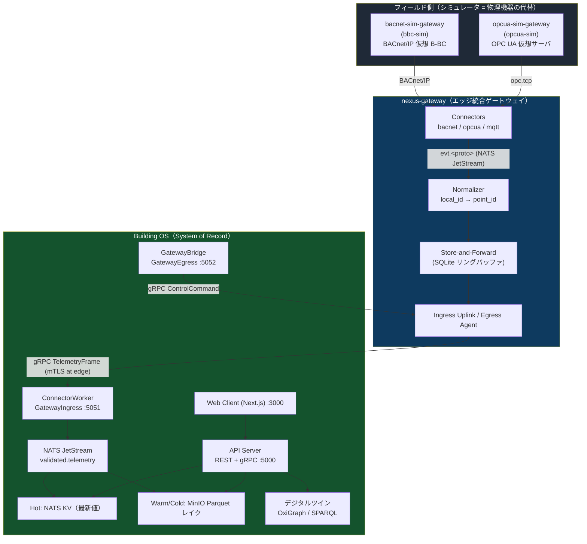

# GUTP スマートビルディング基盤 オンボーディングガイド

nexus-gateway / bacnet-sim-gateway / opcua-sim-gateway / Building OS (OSS) を、
**物理設備なしで** ローカルに立ち上げ、テレメトリ取り込みから点制御までを
E2E（エンドツーエンド）で通すための実践ガイドです。

対象読者は開発者。上から順に実行すれば、**シミュレータ → ゲートウェイ → Building OS →
API/ダッシュボード → 制御** までの一筆書きを再現できます。

> ⚠️ 本スタックはすべて研究・開発用途の OSS です。既定の認証情報・`SecurityPolicy=None`・
> `DISABLE_AUTH=true` などは **ローカル/CI 専用**。実機・本番（設備制御を含む）での利用は
> 利用者の責任で十分に検証のうえ行ってください。

> 📁 **このガイドの配置と相対リンクについて:** 本ドキュメントは Building OS リポジトリの
> `docs/` に置いていますが、内容は 4 リポジトリ（`gutp-building-os-oss-public` /
> `nexus-gateway` / `bacnet-sim-gateway` / `opcua-sim-gateway`）を横断します。文中の
> `nexus-gateway/...` や `gutp-building-os-oss-public/...` などの相対リンクは、
> [Step 0](#step-0--github-からダウンロードリポジトリ取得) で 4 リポジトリを**同じ親ディレクトリ
> `gutp/` に並べた**構成を前提としています。Building OS 単体の内部リンク（`docs/...`）は
> このリポジトリ内で解決できます。

---

## 目次

- [このガイドの読み方（初めての方へ）](#このガイドの読み方初めての方へ)

1. [全体像](#1-全体像)
2. [登場コンポーネントと役割](#2-登場コンポーネントと役割)
3. [Step 0 — GitHub からダウンロード（リポジトリ取得）](#step-0--github-からダウンロードリポジトリ取得)
4. [前提ツール（実行環境の整備）](#4-前提ツール実行環境の整備)
5. [Step A — Building OS を起動する](#step-a--building-os-を起動する)
6. [Step B — nexus-gateway を起動する（単体スモーク）](#step-b--nexus-gateway-を起動する単体スモーク)
7. [Step C — シミュレータを接続する（BACnet / OPC-UA）](#step-c--シミュレータを接続するbacnet--opc-ua)
8. [Step D — nexus-gateway を Building OS につなぐ](#step-d--nexus-gateway-を-building-os-につなぐ)
9. [Step E — ユーザ・ロール・トークン（認証）](#step-e--ユーザロールトークン認証)
10. [Step F — 証明書と mTLS（本番寄り）](#step-f--証明書と-mtls本番寄り)
11. [E2E チェックリスト](#e2e-チェックリスト)
12. [トラブルシューティング](#トラブルシューティング)
13. [ポート早見表](#ポート早見表)
14. [ビジュアル資料（技術レポート HTML）](#ビジュアル資料技術レポート-html)
15. [参照ドキュメント](#参照ドキュメント)

---

## このガイドの読み方（初めての方へ）

**対象読者:** 「Docker はなんとなく聞いたことがある」「ターミナルでコマンドを打った経験は少しある」
くらいの方を想定しています。専門用語（NATS・gRPC・mTLS・Point List など）は知らなくても大丈夫です。
下の用語集にすべて説明があります。

### 各 Step の構成

このガイドの Step A〜F は、すべて次の流れで書かれています。**上から順に、1 つずつ**進めてください。
途中を飛ばすと、あとで「なぜ動かないのか」が分かりにくくなります。

1. **この章でやること** — この Step で何を達成するのかを最初に一言で説明します。
2. **実行するコマンド** — そのままコピー＆ペーストして実行できるコマンドです。
3. **確認方法（うまくいった時の見た目）** — 「これが表示されれば成功」という具体例を示します。
4. **うまくいかない時は** — つまずきやすいポイントは各所に注記し、
   [トラブルシューティング](#トラブルシューティング) にもまとめています。

> 💡 **困ったらまずここへ戻ってください。** 用語が分からなくなったら下の用語集を、
> コマンドがエラーになったら [トラブルシューティング](#トラブルシューティング) を確認してください。

### 最初に知っておくと安心な用語（ミニ用語集）

| 用語 | かんたんな説明 |
|---|---|
| **Docker / コンテナ** | アプリを「ひとまとめの箱（コンテナ）」にして、どの PC でも同じように動かせるようにする仕組み。今回はソフトウェア一式（Building OS、NATS など）をコンテナとして動かします |
| **Docker Compose** | 複数のコンテナを「まとめて起動・停止」するための設定ファイル（`docker-compose.*.yaml`）と、それを使うコマンド（`docker compose up -d` など） |
| **リポジトリ (repository)** | ソースコード一式が入った「フォルダ＋変更履歴」。GitHub からコピー（`git clone`）して手元に置きます |
| **NATS / JetStream** | サービス同士がデータをやり取りするための「郵便局」のようなもの。JetStream はそのメッセージを一時的に保存しておける追加機能です |
| **gRPC** | サービス同士が通信するための方式の一つ（HTTP をより高速・型安全にしたようなもの）。ゲートウェイと Building OS の通信に使われます |
| **Point List（点リスト）** | 「どの機器のどの値が、どんな名前・単位で、どのプロトコルアドレスに対応するか」をまとめた一覧表です |
| **デジタルツイン (twin)** | 建物・フロア・部屋・機器・点（Point）の構成をデータとして表現したもの。Building OS では OxiGraph というデータベースに保存されます |
| **BACnet / OPC-UA** | ビル設備（空調・照明など）でよく使われる通信プロトコル（機器同士の会話のルール）の名前です |
| **Keycloak / JWT** | 「誰がログインしているか」を管理する仕組み。ログインに成功すると JWT という「通行証」のようなトークンが発行されます |
| **mTLS** | 通信の両側（クライアントとサーバ）がお互いに証明書を提示して本人確認を行う、より厳格な暗号通信の方式です |
| **Hot / Warm / Cold** | データの新しさによる保存先の分類。Hot＝直近の最新値、Warm＝数日〜数週間分、Cold＝長期保存（アーカイブ）です |

---

## 1. 全体像



**契約の要（最重要）:** ワイヤ（線）に載る同一性は **`(gateway_id, point_id)`** だけです。
建物・機器・名称・単位といった静的メタデータは毎フレーム送らず、Building OS が
デジタルツインから `point_id` を鍵に補完します。ネイティブアドレス
（BACnet の `analogInput,1001` や OPC-UA の `ns=2;s=PT001`）を `point_id` に解決するのは
**nexus-gateway の Normalizer** の責務です。

**データの流れ（上り = テレメトリ）:**
シミュレータが値を公開 → nexus-gateway のコネクタが読取 → Normalizer が `point_id` を付与 →
Store-and-Forward → gRPC で Building OS の `GatewayIngress` へ → NATS 検証済みバス →
Hot KV（最新値）と Parquet レイク（履歴）へ。

**制御の流れ（下り = コマンド）:**
API `POST /points/{id}/control` → NATS per-gateway subject → GatewayBridge(`GatewayEgress`) →
nexus-gateway の Egress Agent → コネクタが `WriteProperty`（BACnet）/ `Write`（OPC-UA）を実行。

---

## 2. 登場コンポーネントと役割

| コンポーネント | リポジトリ | 役割 | 実装言語 |
|---|---|---|---|
| **Building OS (OSS)** | `gutp-building-os-oss-public` | System of Record。テレメトリ蓄積・API・ダッシュボード・デジタルツイン・制御ルーティング | .NET 8 / Next.js 15 |
| **nexus-gateway** | `nexus-gateway` | エッジ統合ゲートウェイ。プロトコル差異の吸収と `(gateway_id, point_id)` への正規化、Building OS への上り/下り | Go（コネクタは Go/Python/Java）|
| **bacnet-sim-gateway** | `bacnet-sim-gateway` | SBCO 点リストから標準準拠の **仮想 BACnet B-BC** を生成し BACnet/IP で公開 | Python 3.12 |
| **opcua-sim-gateway** | `opcua-sim-gateway` | SBCO 点リストから **仮想 OPC UA サーバ**（アドレス空間）を生成し opc.tcp で公開 | Python 3.12 |

> **用語:** **SBCO**（スマートビルディング共創機構）が点リスト（Point List）のスキーマを定義。
> **GUTP**（グリーン東大 ICT プロジェクト）がプロジェクト全体。**Point List** は
> 「論理点 `point_id` ⇔ プロトコルネイティブアドレス」の対応表で、正本は Building OS の
> デジタルツインにあります。

**責務分担の原則:** Building OS が「登録簿（デジタルツイン）」と「蓄積・API・制御指令元」を持ち、
nexus-gateway は「接続と翻訳」だけを担います。シミュレータは物理設備の代替で、
**1 インスタンス = 1 デバイス**（1 B-BC / 1 OPC UA サーバ）が不変条件です。

---

## Step 0 — GitHub からダウンロード（リポジトリ取得）

> **この章でやること:** GitHub 上にある 4 つのソースコード一式（リポジトリ）を、自分の PC の
> 同じフォルダの中に「並べて」コピーしてきます。これができていないと、この先のどの Step も
> 動かないので、最初に必ず行ってください。

まず 4 つのリポジトリを取得します。**唯一の必須ツールは `git`**（未インストールなら
[git-scm.com](https://git-scm.com/) から。macOS は `xcode-select --install`、Debian/Ubuntu は
`sudo apt-get install -y git`、Windows は Git for Windows）。

| リポジトリ（ローカル配置名） | GitHub | 内容 |
|---|---|---|
| `gutp-building-os-oss-public` | [gutp-bim/gutp-building-os-ri](https://github.com/gutp-bim/gutp-building-os-ri) | ビル OS の参考実装（OSS） |
| `nexus-gateway` | [gutp-bim/nexus-gateway](https://github.com/gutp-bim/nexus-gateway) | ビル OS 用の汎用ゲートウェイ（参考実装） |
| `bacnet-sim-gateway` | [takashikasuya/bacnet-sim-gateway](https://github.com/takashikasuya/bacnet-sim-gateway) | BACnet/IP 仮想 B-BC シミュレータ |
| `opcua-sim-gateway` | [takashikasuya/opcua-sim-gateway](https://github.com/takashikasuya/opcua-sim-gateway) | OPC UA 仮想サーバ シミュレータ |

> **重要 — 配置ルール:** nexus-gateway の統合 Compose は、姉妹シミュレータを **相対パス `../`**
> で参照します（`../bacnet-sim-gateway`, `../opcua-sim-gateway`）。**必ず 4 つを同じ親ディレクトリに
> 並べて** clone してください。並んでいないと Step C のシミュレータビルドが失敗します。

```bash
# 任意の作業用親ディレクトリを作って、その中に 4 つ並べる
mkdir -p ~/gutp && cd ~/gutp

git clone https://github.com/gutp-bim/gutp-building-os-ri   gutp-building-os-oss-public
git clone https://github.com/gutp-bim/nexus-gateway
git clone https://github.com/takashikasuya/bacnet-sim-gateway
git clone https://github.com/takashikasuya/opcua-sim-gateway
```

取得後の配置（この形になっていることを確認）:

```
gutp/                          # 親ディレクトリ（名前は任意）
├── gutp-building-os-oss-public/
├── nexus-gateway/
├── bacnet-sim-gateway/
└── opcua-sim-gateway/
```

```bash
ls -1        # 4 ディレクトリが並んでいれば OK
```

Windows (PowerShell) の場合:

```powershell
New-Item -ItemType Directory -Force ~/gutp | Out-Null; Set-Location ~/gutp
git clone https://github.com/gutp-bim/gutp-building-os-ri   gutp-building-os-oss-public
git clone https://github.com/gutp-bim/nexus-gateway
git clone https://github.com/takashikasuya/bacnet-sim-gateway
git clone https://github.com/takashikasuya/opcua-sim-gateway
Get-ChildItem -Directory | Select-Object Name    # 4 ディレクトリが並んでいれば OK
```

### 補足

- **プライベートリポジトリ / 認証が必要な場合:** SSH 鍵を登録済みなら
  `git clone git@github.com:takashikasuya/<repo>.git`、HTTPS なら
  [Personal Access Token](https://github.com/settings/tokens) を使います。
- **特定ブランチ/タグを使う場合:** `git clone -b <branch> <url>`
  （nexus-gateway は `v0.1.0` public preview がベースライン）。
- **git を使わず ZIP で取得する場合:** 各リポジトリの GitHub ページ →「Code」→
  「Download ZIP」。展開後のフォルダ名が上記の並びになるよう、
  `-main` などのサフィックスを外してリネームしてください
  （特に `gutp-building-os-ri` → `gutp-building-os-oss-public` に合わせる）。
- **更新するとき:** 各ディレクトリで `git pull` を実行します。

> 本ガイドが置かれている `gutp/` 直下は、既にこの配置になっています。
> 既に clone 済みなら Step 0 はスキップして構いません。

---

## 4. 前提ツール（実行環境の整備）

> **この章でやること:** これから使うツールが PC に入っているかを確認し、無ければ導入します。
> **最低限 Docker さえ入っていれば、この先の Step A〜D はすべて進められます。** 他のツール
> （Go / .NET SDK / Node.js / uv / Python）は「コンテナを使わず、ホスト PC で直接ソースコードを
> 動かして開発を速くしたい人向け」のオプションなので、最初は読み飛ばして構いません。

取得したら、共通で必要なものを入れます。

| ツール | バージョン | 使う場面 |
|---|---|---|
| **Docker + Docker Compose** | 最近のもの | 全スタックの起動（最優先） |
| **Go** | ≥ 1.25 | nexus-gateway をホストで直接ビルド/実行する場合 |
| **.NET SDK** | 8.0+ | Building OS の API Server / ConnectorWorker をホストで動かす場合 |
| **Node.js** | 22+ | Building OS の Web Client、nexus-gateway の Admin UI |
| **uv**（Python パッケージ管理） | 最新 | シミュレータ 2 種（Python）をネイティブ実行する場合 |
| **Python** | 3.12+ | 同上 |
| `curl` + `jq` | 任意 | API の疎通確認 |
| Buf CLI | 任意 | Building OS の proto → TS コード生成 |
| **GNU Make** | 任意 | Makefile ショートカット用。**Windows では未同梱**（[後述](#windows-で-make-が使えない場合)の生 `docker compose` で代替可） |

**Docker だけあれば** 各リポジトリの Compose スタックは起動できます。ホスト実行
（`go run` / `dotnet run` / `uv run`）は開発ループを速くしたいとき用です。

> 💡 **`make` は必須ではありません。** Building OS の Makefile ターゲットは薄い `docker compose`
> ラッパーです。Windows のように `make` が無い環境では、[Windows で make が使えない場合](#windows-で-make-が使えない場合)
> の対応表どおり `docker compose` を直接叩けば同じことができます。

### Raspberry Pi / Debian 系でシミュレータをネイティブ実行する場合

opcua-sim は `cryptography`/`cffi` のビルドにヘッダが必要です。`uv sync` の前に導入してください。

```bash
sudo apt-get update
sudo apt-get install -y build-essential libffi-dev libssl-dev
# 未導入だと `fatal error: ffi.h: No such file or directory` で失敗します
```

---

## Step A — Building OS を起動する

> **この章でやること:** Building OS（テレメトリを蓄え、API を提供し、ダッシュボードを表示する本体）を
> Docker で一括起動し、「全部のサービスが安定して動いている」ことを確認します。
> ここでつまずいたら、この先の Step はすべて進めません。登場人物は Docker のみです（`go`/`dotnet`/`node` は不要）。

> ℹ️ **これは一気通貫の E2E（Step D で合流）向けです。** ゲートウェイの単体スモークだけが目的なら、
> Step A は飛ばして [Step B](#step-b--nexus-gateway-を起動する単体スモーク) から始められます
> （ゲートウェイはローカル Point List + 同梱 mock Building OS で動くため）。

フル E2E では Building OS が System of Record なので **最初に立ち上げます**。

### A-1. OSS スタックを起動

```bash
cd gutp-building-os-oss-public

make local-up-oss
# 中身は: docker compose -f docker-compose.oss.yaml up -d

make wait-oss-stack       # 全サービス healthy まで待機（最大 120 秒）
```

> 🔍 **この 2 行で何が起きているか:** 1 行目は「下の表のサービスをすべてコンテナとして起動」、
> 2 行目は「各コンテナのヘルスチェックが OK（healthy）になるまで待つ」処理です。
> `docker compose ... up -d` の `-d` は「バックグラウンドで起動」という意味で、コマンドを実行した
> ターミナルはすぐに使える状態に戻ります。初回はイメージのダウンロードが発生するため、
> 回線速度によっては数分かかることがあります（ここは待ってください）。
>
> **うまくいった時の見た目:** `make wait-oss-stack` がエラーなく終了すれば OK です。
> 心配なら `docker compose -f docker-compose.oss.yaml ps` を実行し、各サービスの `STATUS` 列が
> `Up (healthy)` になっていれば問題ありません。
```

これで既定構成（`WARM_STORE=parquet`）の以下が起動します。**可観測系（Prometheus / Grafana /
Loki / Tempo）は既定では起動しません**（`--profile observability` の opt-in。[A-1b](#a-1b-起動オプション最小構成プロファイル) 参照）。

| サービス | 役割 | ポート | 既定起動 |
|---|---|---|---|
| NATS JetStream | コアメッセージバス | 4222 / 8222 | ✅ |
| PostgreSQL 16 | ユーザ/グループ/権限 + 制御監査 | 5433 | ✅ |
| pgBouncer / pgBouncer-session | 接続プール（アプリ / EF Core マイグレーション） | 6432 / 6433 | ✅ |
| OxiGraph | デジタルツイン（SPARQL） | 7878 | ✅ |
| MinIO | Parquet レイク（S3 互換） | 9000 / 9001(console) | ✅ |
| Keycloak | 認証（OIDC/JWT） | 8080 | ✅ |
| ConnectorWorker | 取り込みワーカー（+ 任意 gRPC ingress） | 8081(health) / 5051(ingress)※ | ✅ |
| GatewayBridge | 制御 egress（gRPC bidi） | 5052 | ✅ |
| Prometheus / Grafana / Loki / Tempo / otel-collector / postgres-exporter | 可観測性 | 9090 / 3010 / 3100 / 3200 / 4317-4318 | ⛔ `--profile observability` |

> ※ gRPC ingress（`GatewayIngress`）は `GRPC_INGRESS_PORT` を設定したときだけ listen します
> （OSS 既定は未設定 = health のみ）。Step D で有効化します。

### A-1b. 起動オプション（最小構成・プロファイル）

用途に応じて Compose 構成を選べます。まず押さえるべき要点:

- **OSS ベーススタック（`docker-compose.oss.yaml` のプロファイル無し起動）は、そのまま
  「可観測性を除いた最小構成」です。** 可観測系・MQTT・TimescaleDB・LLM アシスタントは
  すべて Compose の `profiles:` の裏に隠れており、フラグを付けない限り起動しません。
  **データ保存（MinIO Parquet レイク + PostgreSQL）とポイントリスト取込（OxiGraph）は
  ベース側に含まれます。**
- `docker-compose.minimal.yaml` は **NATS + PostgreSQL + pgBouncer のみ**で、
  **MinIO も OxiGraph も Keycloak も含みません**。したがって **Parquet への履歴蓄積も
  twin へのポイントリスト取込もできません**。データ保存・point list を伴う検証には向きません。

| 構成 / ファイル | 含まれるもの | データ保存 | Point List 取込 | 用途 | 起動コマンド |
|---|---|---|---|---|---|
| **可観測性を除いた最小構成**（推奨）`docker-compose.oss.yaml`（プロファイル無し） | NATS / PostgreSQL / pgBouncer / OxiGraph / MinIO / Keycloak / API / ConnectorWorker / GatewayBridge（可観測系なし） | ✅ MinIO Parquet + PostgreSQL | ✅ OxiGraph | 標準の軽量起動。テレメトリ蓄積・twin 取込まで可能 | `docker compose -f docker-compose.oss.yaml up -d` |
| **OSS + Web Client** `docker-compose.oss.yaml` `--profile webclient` | 上記 + Next.js Web Client（`building-os.web` :3000） | ✅ | ✅ | UI もコンテナで一括起動したいとき（`yarn dev` 不要） | `docker compose -f docker-compose.oss.yaml --profile webclient up -d --build` |
| **OSS + 可観測性** `docker-compose.oss.yaml` `--profile observability` | 上記 + Prometheus / Grafana / Loki / Tempo / otel-collector | ✅ | ✅ | ダッシュボード/トレースまで見たいとき | `docker compose -f docker-compose.oss.yaml --profile observability up -d` |
| **超最小構成** `docker-compose.minimal.yaml` | NATS + PostgreSQL + pgBouncer のみ（**MinIO / OxiGraph / Keycloak なし**） | ⛔ | ⛔ | メッセージング/DB だけの PoC | `docker compose -f docker-compose.minimal.yaml up -d` |
| **デバイスシミュレータ追加** `docker-compose.dev.yaml` | OSS 起動済み前提で仮想エッジデバイス（MQTT）を追加 | — | — | MQTT でテレメトリを流したいとき | `docker compose -f docker-compose.oss.yaml --profile mqtt up -d` → `docker compose -f docker-compose.dev.yaml up -d` |
| **レガシー** `docker-compose.yaml` | Azure 互換補助・Redis 等 | — | — | 後方互換 | `docker compose up -d` |

> **まとめ:** 「可観測性は要らないが、データ保存とポイントリスト取込はしたい」＝
> **`docker compose -f docker-compose.oss.yaml up -d`（プロファイル無し）** が答えです。
> `minimal.yaml` は要件を満たしません（twin / レイクが無い）。

#### Windows で make が使えない場合

Windows には `make` が同梱されていません。Makefile のターゲットは単なる `docker compose`
ラッパーなので、**PowerShell から生コマンドを直接叩けば同じ結果**になります。

| make ターゲット | Windows (PowerShell) で叩く生コマンド |
|---|---|
| `make local-up-oss` | `docker compose -f docker-compose.oss.yaml up -d` |
| `make local-down-oss` | `docker compose -f docker-compose.oss.yaml down` |
| `make local-up-minimal` | `docker compose -f docker-compose.minimal.yaml up -d` |
| `make local-down-minimal` | `docker compose -f docker-compose.minimal.yaml down` |
| `make local-up-dev` | `$env:MQTT_HOST="building-os.mosquitto"; docker compose -f docker-compose.oss.yaml --profile mqtt up -d; docker compose -f docker-compose.dev.yaml up -d` |
| `make wait-oss-stack` | （下記の `docker compose ps` で代替） |

状態確認（`wait-oss-stack` の代替）:

```powershell
docker compose -f docker-compose.oss.yaml ps
curl http://localhost:5000/api/system/status   # API 経由の疎通
```

> ⚠️ `make wait-oss-stack` / `make mvp-test` などは内部で `bash` / `timeout` / `python3` を使う
> Unix 前提のターゲットです。Windows の素の `make` を入れても動かないため、**PowerShell から
> `docker compose` を直接叩くのが確実**です。どうしても `make` を使いたい場合のみ
> `winget install GnuWin32.Make`（または `choco install make` / `scoop install make`）で導入できますが、
> 上記 `bash` 依存ターゲットは WSL などが別途必要になります。

追加プロファイル（`docker-compose.oss.yaml` に対して有効化）:

```bash
# 可観測性（Prometheus / Grafana / Loki / Tempo）を足す（A-7）
docker compose -f docker-compose.oss.yaml --profile observability up -d

# MQTT ブローカ（Mosquitto）を足す（#25）
MQTT_HOST=building-os.mosquitto docker compose -f docker-compose.oss.yaml --profile mqtt up -d

# Warm 層を TimescaleDB にする（既定は Parquet。opt-in）
WARM_STORE=timescale TIMESCALE_CONNECTION_STRING=<conn> \
  docker compose -f docker-compose.oss.yaml --profile timescale up -d
```

Windows (PowerShell) で環境変数を前置きする場合は `$env:` で設定してから実行します:

```powershell
$env:MQTT_HOST="building-os.mosquitto"
docker compose -f docker-compose.oss.yaml --profile mqtt up -d
```

#### A-1c. 既存 MQTT ブローカー（例: localhost:11883）を使う場合（任意）

ホスト上で既に MQTT ブローカーが動いている場合、ConnectorWorker をその接続先へ向けられます。
Docker コンテナからホストへ接続するため、`MQTT_HOST=host.docker.internal` を使います。

```bash
MQTT_HOST=host.docker.internal MQTT_PORT=11883 MQTT_USERNAME=devices MQTT_PASSWORD=buildingos-devices \
  docker compose -f docker-compose.oss.yaml up -d --force-recreate --no-deps building-os.connector-worker
```

最小スモーク（1件 publish）例:

```bash
MQTT_HOST=localhost MQTT_PORT=11883 MQTT_USERNAME=devices MQTT_PASSWORD=buildingos-devices \
  TELEMETRY_INTERVAL=1 DEVICE_ID=device-001 TENANT_ID=default POINT_ID=PT001 \
  python Tools/development-edge-device/mqtt_edge_device.py
```

受信条件（実装仕様）:

- topic は `telemetry/{tenant}/{deviceId}`
- payload は JSON（UTF-8 BOM なし推奨）

### A-2. API Server と Web Client を起動

**API Server と Web Client は両方とも Docker（compose）に含められます。**

- **API Server** は OSS ベーススタックに既に含まれており（`building-os.api`、ポート 5000）、
  `docker compose ... up -d` で自動起動します。
- **Web Client** は最小構成を保つため既定では起動せず、**`--profile webclient` のオプトイン**で
  compose 起動できます（`building-os.web`、ポート 3000）。

```bash
# Web Client も含めて Docker で一括起動（ビルドを伴う）
docker compose -f docker-compose.oss.yaml --profile webclient up -d --build
# → API: http://localhost:5000 / Swagger: http://localhost:5000/swagger
# → Web: http://localhost:3000
```

> ℹ️ **`NEXT_PUBLIC_*` はブラウザバンドルへ *ビルド時* に焼き込まれます。** compose は build args
> として `NEXT_PUBLIC_API_BASE_URL`（既定 `http://localhost:5000`）等を渡すため、値を変えたら
> `--build` で再ビルドが必要です。ブラウザはホスト側で動くので API はホストマップの
> `localhost:5000` を指し、SSR/route handler は `API_BASE_URL=http://building-os.api:8080`
> でコンテナ内 DNS を使います。カスタマイズは [.env.example](../.env.example) の
> `NEXT_PUBLIC_*` を参照。

ホストで直接動かして開発ループを速くしたい場合は、compose ではなく次を使います（compose 版と
どちらか一方で十分）:

```bash
# API Server（別ターミナル）— ローカル Docker サービスに接続
cd DotNet/BuildingOS.ApiServer
dotnet run --launch-profile WithLocal
# → REST/gRPC: http://localhost:5000   Swagger UI: http://localhost:5000/swagger

# Web Client（別ターミナル）
cd web-client
yarn install && yarn dev
# → http://localhost:3000
```

`WithLocal` プロファイルは `DISABLE_AUTH=true` なので、**ローカルでは Keycloak トークンなし**で
API を叩けます（認証を試すときは `WithLocalAuth`。詳細は [Step E](#step-e--ユーザロールトークン認証)）。

### A-3. デジタルツインに設備（Point List の正本）を入れる

> ⭐ **この Step D と共通で使える完成済み fixture を用意しています:**
> [`../fixtures/e2e/`](../fixtures/e2e/README.md)。`twin.ttl`（Building OS twin 正本 = 8 point /
> `GW-SOS-001` / `bldg-e2e`）をそのまま `/admin/twin` に replace アップロードするか
> `OXIGRAPH_SEED_TTL_PATH` で投入し、nexus-gateway 側は同ディレクトリの `pointlist.csv` を
> `PROVISIONING_FILE` に渡せば、両者が同じ `(gateway_id, point_id)` を指した状態になります。
> 以下は最小例（自作する場合の参考）。

読み取り・制御は **twin に登録された point** を起点に解決されます（未登録は 404）。
Web Client の `/admin/twin`（`http://localhost:3000/admin/twin`）から Turtle を
アップロードするのが簡単です。最小例:

```turtle
@prefix sbco: <https://www.sbco.or.jp/ont/> .

<https://example.com/bldg/bldg-1> a sbco:Building ;
    sbco:name "デモビル" ; sbco:building "bldg-1" .

<https://example.com/point/pt-001> a sbco:PointExt ;
    sbco:name "室温" ; sbco:unit "degC" ;
    sbco:localId "PT-001" ; sbco:gatewayId "GW-DEMO" ;
    sbco:building "bldg-1" .   # 必須: ingress でビルを解決するために使用
```

起動時シードで自動投入する場合は、環境変数 `OXIGRAPH_SEED_TTL_PATH` に Turtle ファイルを
指定すると、起動のたびにデフォルトグラフを全置換します（`OxiGraphSeedHostedService`）。

> **gateway_id 制約:** 1 つの `gateway_id` は 1 つのビルにのみ所属できます
> （複数ビルにまたがると起動停止 or 409）。E2E では `GW-SOS-001` のような ID を使います。

### A-4. 起動確認

**CLI（curl）で確認:**

```bash
curl http://localhost:5000/api/system/status      # API 全体
curl 'http://localhost:5000/telemetries/query?pointId=demo-pt-001&latest=true'  # 最新値（空でOK）
# MinIO console http://localhost:9001（可観測性 profile 起動時は Grafana http://localhost:3010 も）
```

**UI（ブラウザ）で確認:** Web Client を起動している場合（`--profile webclient` または `yarn dev`）、
以下の画面で同じことを目視できます。初回は Keycloak ログイン（[Step E](#step-e--ユーザロールトークン認証)。
既定 `admin` / `admin`。`DISABLE_AUTH=true` ならログイン不要）。

| 見たいもの | URL | 画面の内容 |
|---|---|---|
| システム稼働状況 | `http://localhost:3000/platform/status` | API / 各サービスの up/down・KPI（`/api/system/status` の UI 版） |
| 資源ツリー（twin） | `http://localhost:3000/resources` | 建物 → フロア → 部屋 → 機器 → 点の階層。twin 投入後に階層が見える |
| 点の最新値・履歴 | `http://localhost:3000/points/{pointId}` | Hot（最新値）・Warm（24h グラフ）・制御・Cold ダウンロード |
| MinIO（Parquet 実体） | `http://localhost:9001` | オブジェクトストレージのコンソール（バケット `buildingos`） |

> 補足: `http://localhost:3000/admin` はユーザ/グループ/権限・twin 管理用ワークスペースです。
> テレメトリ時系列の確認は `/resources` → `/points/{pointId}` を使います。

---

## Step B — nexus-gateway を起動する（単体スモーク）

> **この章でやること:** nexus-gateway（フィールドと Building OS を中継するゲートウェイ）を、
> 実の Building OS なしに単体で起動し、自分の PC 上でちゃんと動くことを確認します。
> このステップの目的はあくまで「ゲートウェイ単体の存在確認」であり、実際のテレメトリや制御は
> まだ流しません（それは Step C・D で行います）。

まずゲートウェイ単体が動くことを確認します。ローカル Point List の指定は、フラグ/環境変数で
切り替えます（[README の設定表](nexus-gateway/README.md)参照）。

| 用途 | フラグ / 環境変数 | 既定 |
|---|---|---|
| bootstrap 用の Point List ファイル | `--point-list` / `POINT_LIST_FILE` | `fixtures/point_list.json` |
| ファイル/CSV 由来の Point List（dev/E2E） | `--provisioning-file` / `PROVISIONING_FILE` | – |
| 同期先の Building OS provisioning API | `--provisioning-url` / `PROVISIONING_URL` | –（未指定なら上のファイルを使用） |

### B-1. フルスタック（NATS + mock Building OS + gateway + Keycloak + Admin UI）

```bash
cd nexus-gateway
docker compose up --build
docker compose ps        # 全サービスが ~60 秒で healthy になる
```

> 同一マシンで Building OS（`localhost:5000/5051/5052`）と共存させる場合は、
> `docker-compose.live-bos.yml` オーバーレイを併用してください。
> このオーバーレイは gateway の接続先(ingress/egress)を
> `host.docker.internal:5051/5052` に向けます。`mock-bos` も一緒に起動しますが
> (Compose の仕様上、override ファイルからベースの `depends_on` エントリを
> 削除できないため)、gateway はこちらを見なくなるので未使用のまま放置して
> 問題ありません(ポートの衝突もありません)。

```bash
cd nexus-gateway
docker compose -f docker-compose.yml -f docker-compose.live-bos.yml up --build
```

ポートが競合する場合は、nexus-gateway の `docker-compose.yml` はホスト公開ポートを
すべて固定値でハードコードしているため(`.env` での上書きには対応していません)、
競合するポートの行を直接編集してください(例: `"18080:8080"` → `"18081:8080"`)。

| エンドポイント | URL | 備考 |
|---|---|---|
| Admin UI | http://localhost:13000 | Keycloak realm `nexus-gateway`。`operator`/`operator`, `viewer`/`viewer` |
| Gateway Admin API | http://localhost:18080 | `/health`, `/metrics`, `/connectors` |
| Keycloak | http://localhost:18090 | Admin: `admin`/`admin` |
| mock Building OS (gRPC) | `localhost:15051` | `GatewayIngressService` スタブ（dev） |
| NATS | `localhost:14222` | クライアント。監視 `:18222` |

### B-2. 稼働確認（認証不要のエンドポイント）

```bash
curl -s http://localhost:18080/health | jq      # uptime / mem / disk / コネクタ生存性
curl -s http://localhost:18080/metrics          # Prometheus 形式（gateway_* / normalizer_*）
```

### B-3. 機器なしの最速ループ（in-process sim コネクタ）

`--dev-sim` は in-process の疑似データ生成を追加するフラグで、
**NATS と BOS（mock/実機）への接続そのものは省略しません**。Go コードを速く回すときは、
先に接続先を起動してから実行してください。

- `docker compose up` 済み（`localhost:14222` / `localhost:15051` が利用可能）:

```bash
NATS_URL=nats://localhost:14222 \
BOS_ADDR=localhost:15051 \
BOS_INSECURE=true \
go run ./cmd/gateway --dev-sim --dev-sim-interval 5s
curl -s http://localhost:8080/telemetry | jq    # sim→JetStream→Normalizer→S&F を端から端まで観察
```

Windows (PowerShell):

```powershell
$env:NATS_URL = "nats://localhost:14222"
$env:BOS_ADDR = "localhost:15051"
$env:BOS_INSECURE = "true"
go run ./cmd/gateway --dev-sim --dev-sim-interval 5s
Invoke-RestMethod http://localhost:8080/telemetry | ConvertTo-Json -Depth 10
```

1 行で実行する場合（PowerShell）:

```powershell
$env:NATS_URL="nats://localhost:14222"; $env:BOS_ADDR="localhost:15051"; $env:BOS_INSECURE="true"; go run ./cmd/gateway --dev-sim --dev-sim-interval 5s
```

- 手元の `nats-server` / `mock-bos` を別ポートで起動済みの場合:
  その接続先に `NATS_URL` / `BOS_ADDR`（必要なら `BOS_INSECURE=true`）を合わせてください。

> `--dev-sim` は本番非対応の合成コネクタです（ADR-0001）。`--admin-jwks-url` 未指定時は
> Admin API が **認証無効**（dev 専用、警告ログ）になり、トークンなしで `/devices` などを叩けます。

---

## Step C — シミュレータを接続する（BACnet / OPC-UA）

> **この章でやること:** 物理の空調・センサーなしでも試せるように、仮想の機器（シミュレータ）を
> 立ち上げ、nexus-gateway のコネクタがその値を読み取れることを確認します。ここではまだ
> Building OS とは繋ぎません（Step D で繋ぎます）。

nexus-gateway の統合 Compose overlay（`docker-compose.integration.yml`）が、
**姉妹シミュレータ + 対応コネクタ**を、共有 Point List
（`fixtures/integration/point_list.json`）1 つから駆動します。8 つの論理点
`PT001..PT008` を **両シミュレータが** プロトコルネイティブアドレスでモデル化しています。

| point_id | BACnet (bbc-sim) | OPC-UA (opcua-sim) | writable |
|---|---|---|---|
| PT001 | `analogInput,1001` | `ns=2;s=PT001` | no |
| PT004 | `binaryOutput,2001` | `ns=2;s=PT004` | **yes** |
| PT006 | `analogValue,1002` | `ns=2;s=PT006` | **yes** |
| PT007 | `multiStateValue,3001` | `ns=2;s=PT007` | **yes** |
| … | （PT002/003/005/008 も同様に定義） | | |

プロファイルで 2 プロトコルを分離し、各 `point_id` の供給元を 1 つに保ちます。

```bash
cd nexus-gateway

# OPC-UA E2E（plain TCP:4840、CI フレンドリ）— ../opcua-sim-gateway をビルド
docker compose -f docker-compose.yml -f docker-compose.integration.yml --profile opcua up

# BACnet E2E（Who-Is/I-Am ブロードキャストのため host networking 必須）— ../bacnet-sim-gateway をビルド
docker compose -f docker-compose.yml -f docker-compose.integration.yml --profile bacnet up
```

> 統合 overlay は gateway を `PROVISIONING_FILE=/fixtures/integration/point_list.csv` /
> `DEV_SIM=false` に上書きし、`KEYCLOAK_JWKS_URL` を空（認証なし）にします。

### リモート/実機に向ける場合（シミュレータをビルドしない）

`*-remote` プロファイルとエンドポイント環境変数を使います。

```bash
OPCUA_ENDPOINT=opc.tcp://192.0.2.10:4840 \
  docker compose -f docker-compose.yml -f docker-compose.integration.yml --profile opcua-remote up -d

BACNET_ADDRESS=192.0.2.10 \
  docker compose -f docker-compose.yml -f docker-compose.integration.yml --profile bacnet-remote up -d
```

### シミュレータ単体を触ってみる（任意）

各シミュレータは独立でも動きます。まず OPC-UA:

```bash
cd opcua-sim-gateway
uv sync
uv run opcua-sim generate-yaml examples/pointlists/sample_pointlist.csv -o config/simulator.yaml
uv run opcua-sim run                              # opc.tcp://0.0.0.0:4840
uv run opcua-sim browse opc.tcp://localhost:4840  # 別端末からブラウズ
```

BACnet:

```bash
cd bacnet-sim-gateway
uv sync
uv run bbc-sim generate-yaml --input tests/fixtures/sample_pointlist.csv --output config/simulator.yaml
uv run bbc-sim run --config config/simulator.yaml   # BACnet/IP 北向き公開
# 別端末で疎通確認
uv run bbc-sim whois
uv run bbc-sim list-objects
# Admin UI（localhost 限定・認証なし）
uv run bbc-sim run -c config/simulator.yaml --rest-port 8080 --ui   # → http://127.0.0.1:8080/ui/
```

> シミュレータの Admin UI は **`127.0.0.1` バインド・認証なし（MVP）**。信頼できない
> ネットワークに晒さないこと。opcua-sim の既定 `SecurityPolicy=None`・匿名アクセスも同様に
> ローカル/CI 専用です。

### C-1. 共有 fixture で一気通貫（`fixtures/e2e/` を opcua-sim に渡す）

上の単体例は opcua-sim 同梱の **サンプル**（`examples/pointlists/sample_pointlist.csv` /
`tests/fixtures/sample_pointlist.csv` = `GW001` / `PT001..PT008` / AHU のデモデータ）を使います。
これは opcua-sim のスキーマ確認用で、**Building OS の twin 正本とは別データセット**です。
一気通貫（Building OS ⇔ 接続GW ⇔ opcua-sim）を同一データで通すには、
[`../fixtures/e2e/pointlist.csv`](../fixtures/e2e/README.md)（`GW-SOS-001` / `SOS-PT-001..008` /
`bldg-e2e`）を **そのまま** `generate-yaml` に渡します。

```bash
cd opcua-sim-gateway
uv sync
# ↓ 同梱サンプルではなく、Building OS twin 正本と同一データセットの共有 fixture を使う
uv run opcua-sim generate-yaml ../gutp-building-os-ri/fixtures/e2e/pointlist.csv -o config/simulator.yaml
uv run opcua-sim run                              # opc.tcp://0.0.0.0:4840
uv run opcua-sim browse opc.tcp://localhost:4840
```

**`local_id` ＝ OPC-UA `node_id` の契約（最重要）:** opcua-sim は各点の node_id を
`ns=2;s=<point_id>`（`VENDOR_NS=2`、`docs/specs/node-id-numbering.md` §2）で採番します。
共有 fixture の `point_id` は `SOS-PT-001..008` なので、生成される node_id は
`ns=2;s=SOS-PT-001..008` です。この値を Building OS twin 側の `sbco:localId`
（＝汎用のデバイス側識別子。BACnet なら ObjectID、OPC-UA なら nodeId）に一致させてあり、
`twin.ttl` / `pointlist.json` / `pointlist.csv` / opcua-sim 生成 node_id の **4 者で全 8 点が一致**
します（`fixtures/e2e/README.md` に検証手順あり）。

| point_id | opcua-sim `node_id` = twin `sbco:localId` | DataType | writable |
|---|---|---|---|
| SOS-PT-001（室温） | `ns=2;s=SOS-PT-001` | Double | no |
| SOS-PT-004（照明 On/Off） | `ns=2;s=SOS-PT-004` | Boolean（Off/On） | **yes** |
| SOS-PT-006（設定温度） | `ns=2;s=SOS-PT-006` | Double | **yes** |
| SOS-PT-007（ファン速度） | `ns=2;s=SOS-PT-007` | Int32（Off/Low/Medium/High） | **yes** |

> **共有 CSV の互換ポイント:** opcua-sim は多状態を `states` 列（`|` 区切り）から読み、
> SBCO 標準の `labels`（`&&` 区切り）は読みません。また `point_specification` からは多状態を
> 導出できず Command→binary になるため、Fan Speed（4 状態）は `point_type=multistate` を明示
> しています。共有 fixture はこの両方を満たすよう作ってあるので、**追加加工なしにドロップイン**
> で `generate-yaml` に通ります。

**よくある 2 つの疑問への回答:**

- **Q. Building OS に `twin.ttl` を取り込めば opcua-sim にも同期される？** → いいえ。opcua-sim は
  Building OS クライアントを持たない純粋な OPC UA **サーバ**シミュレータで、CSV からアドレス空間を
  生成して北向き公開するだけです。したがって **同じ `pointlist.csv` を opcua-sim にも別途渡す**
  必要があります（正本 twin と同一データセットなので内容は一致）。twin から自動追従するのは
  point-list-sync 対応の**接続ゲートウェイ**（nexus-gateway、`GET /gateways/GW-SOS-001/pointlist`
  の ETag ポーリング／NATS プッシュ）側です。
- **Q. opcua-sim 同梱サンプルと内容同期している？** → いいえ（同梱サンプルは別デモデータ）。ただし
  共有 fixture は **スキーマ互換のドロップイン置換**で、opcua-sim の実ジェネレータで
  `ns=2;s=SOS-PT-00X` を生成することを検証済みです。一気通貫では**サンプルではなく共有
  `pointlist.csv`** を使ってください。

---

## Step D — nexus-gateway を Building OS につなぐ

> **この章でやること:** ここがこのガイドの本番です。Step B/C で確認したゲートウェイとシミュレータを、
> Step A で起動した本物の Building OS に接続し、**テレメトリの取り込み（上り）と機器制御（下り）**
> が一気に通ることを確認します。事前に Step A・C を終えておいてください。

mock Building OS の代わりに、Step A で起動した **実 Building OS** に向けます。

### D-1. Building OS 側で gRPC ingress を有効化

```bash
cd gutp-building-os-oss-public
GRPC_INGRESS_PORT=5051 docker compose -f docker-compose.oss.yaml up -d --force-recreate \
  --no-deps building-os.connector-worker
```

Windows (PowerShell):

```powershell
Set-Location gutp-building-os-oss-public
$env:GRPC_INGRESS_PORT="5051"
docker compose -f docker-compose.oss.yaml up -d --force-recreate --no-deps building-os.connector-worker
```

- ingress（テレメトリ）: `building-os.connector-worker` の `GatewayIngress` = **:5051**
- egress（制御）: `building-os.gateway-bridge` の `GatewayEgress` = **:5052**（常時待受）

### D-2. gateway を Building OS に向けて起動

同一マシン共存（Docker Compose）では、live-bos オーバーレイを使うのが最短です。
**このオーバーレイだけでは足りません**(#81) — nexus-gateway の既定 namespace
(`GATEWAY_ID=gw-001`、点 `supply_air_temp`/`fan_run`)は、Building OS の既定 OSS スタックが
自動 seed する SoS twin(`GATEWAY_ID=GW-SOS-001`、点 `SOS-PT-001..008`、#124)と一致しません。
一致しないまま起動すると、全フレームが unknown-point としてスキップされます。
`docker-compose.sos-demo.yml` オーバーレイも重ねて、nexus-gateway 側を SoS namespace に
揃えてください:

```bash
cd nexus-gateway
docker compose -f docker-compose.yml -f docker-compose.live-bos.yml \
  -f docker-compose.sos-demo.yml up --build
```

- `mock-bos` も一緒に起動しますが(override から `depends_on` は外せません)、
  gateway の接続先は下記のとおり切り替わるので未使用のまま放置して構いません。
- gateway の上り/下り接続先は `host.docker.internal:5051/5052` を想定します。
- `docker-compose.sos-demo.yml` は `GATEWAY_ID=GW-SOS-001` を設定し、既定の sim コネクタを
  無効化し、`PROVISIONING_FILE` をこのリポジトリの `fixtures/e2e/pointlist.csv`(sibling
  checkout を bind mount)に向けます — 新しい fixture ファイルは不要です。
- `docker compose -f docker-compose.yml -f docker-compose.live-bos.yml -f docker-compose.sos-demo.yml config`
  で gateway の `GATEWAY_ID`/`BOS_INGRESS_ADDR`/`BOS_EGRESS_ADDR`/`PROVISIONING_FILE` が
  意図通りマージされていることを事前確認できます。
- `GET /gateways/{id}/pointlist` による twin 駆動の同期は、認証を要求します
  (`GatewayProvisioningController`: admin または `X-Gateway-Id` trusted header 一致)。
  nexus-gateway の provisioning クライアントはこのヘッダを送らないため、**ローカルデモでは
  Building OS 側の既定 `DISABLE_AUTH=true` により偶然成立しています**(twin 変更が
  `PROVISIONING_FILE` のスナップショットへ反映されるには手動再取得が必要な点に注意)。
  本番では [Step F](#step-f--証明書と-mtls本番寄り) の mTLS 経由 trusted header が必要です。

ホスト実行(`go run`)で直接つなぐ場合は従来どおり次の手順です。**ingress と egress は
別ポート**なので両方指定してください — `BOS_ADDR` 単体では egress が ingress 側の
ポートへフォールバックし、制御コマンドが無言で届かなくなります(nexus-gateway の
`resolveBOSAddr()` フォールバック挙動)。

```bash
cd nexus-gateway
GATEWAY_ID=GW-SOS-001 \
BOS_INGRESS_ADDR=localhost:5051 \
BOS_EGRESS_ADDR=localhost:5052 \
BOS_INSECURE=true \
PROVISIONING_FILE=/path/to/mvp-pointlist.csv \
go run ./cmd/gateway
```

- `GATEWAY_ID` は twin に登録した `sbco:gatewayId` と一致させます（例 `GW-SOS-001`）。
- `BOS_INSECURE=true`（平文 h2c）は **dev/CI 専用**。本番は [Step F](#step-f--証明書と-mtls本番寄り) の mTLS に置き換えます。
- Point List は Building OS の twin が正本。`PROVISIONING_URL=https://.../provisioning` を
  与えれば twin から同期（ETag / `If-None-Match`→304 / `?since=` 差分）します。

### D-3. 上り（テレメトリ）を確認

Building OS の Hot KV に最新値が反映されることを確認します。

**CLI（curl）:**

```bash
# ingress の受理挙動（既知 point は Accepted、未知 point_id / 他 gateway 所有は skip）
curl 'http://localhost:5000/telemetries/query?pointId=SOS-PT-001&latest=true'
```

**UI（ブラウザ）:** `http://localhost:3000/points/SOS-PT-001`（または `/resources` から点を辿る）を開き、
**Hot（最新値）** を「取得」して gateway が送った値が更新されるのを確認します。しばらく流し続ければ
**Warm（過去 24h グラフ）** に系列が描画されます。

- 受理: 既知 `point_id` かつ当該 `gateway_id` が所有 → 永続化（`StreamAck.accepted` に計上）。
- 拒否（skip + メータ）: 未知 `point_id` / 所有不一致 / publish 不成立。

### D-4. 下り（制御）を確認

**CLI（curl）:**

```bash
# writable な点に制御指令（202 + controlId、結果は非同期）
curl -X POST 'http://localhost:5000/points/SOS-PT-004/control' \
  -H 'Content-Type: application/json' -d '{"value": 1}'
```

**UI（ブラウザ）:** `http://localhost:3000/points/SOS-PT-004` を開き、**制御（Control）** から値を入力して
送信します（`useControlExecution()` 経由の gRPC ストリーミング）。実行結果がストリームで返り、
writable でない点では制御 UI が無効／403 になることを確認できます。operator 以上のロールが必要です。

制御が **実 egress**（GatewayBridge → nexus-gateway → コネクタ → シミュレータの WriteProperty）を
通るには、対象 gateway の binding を `bacnet-sim` にします（OSS 既定は
`ENABLE_SIM_CONTROL=true` のシミュレート制御で、常に成功扱いになる点に注意）。

```bash
# API 側の環境変数（対象 gateway を実 egress に）
GatewayConnectionTypes__Map__GW-SOS-001=bacnet-sim
```

購読者（gateway）が未接続なら per-gateway NATS request が no-responders となり、
API は結果を待たず **503**（オフライン即時失敗）を返します。

### D-5. E2E テストで自動検証（任意・推奨）

nexus-gateway 側の Go E2E がそのまま検証に使えます（env 未設定なら自動 skip）。

```bash
cd nexus-gateway
# #44 — 取り込み + API 読み戻し（M4/M5）
E2E_BOS_INGRESS_URL=localhost:5051 E2E_BOS_API_URL=http://localhost:5000 \
  go test ./integration/... -run TestE2E_BosIngestAPI -v -timeout 60s

# #45 — 制御ゲート（writable→202 / 非writable→403）
E2E_BOS_API_URL=http://localhost:5000 \
  go test ./integration/... -run TestE2E_BosControlGate -v -timeout 30s

# #45 — egress ディスパッチ（gateway-bridge:5052 + binding=bacnet-sim が必要）
E2E_BOS_EGRESS_ADDR=localhost:5052 E2E_BOS_API_URL=http://localhost:5000 \
  go test ./integration/... -run TestE2E_BosEgressDispatch -v -timeout 60s
```

シミュレータ ↔ コネクタ間だけを見たい場合は Layer 2（`E2E_NATS_URL=nats://localhost:14222`）を
使います（`TestE2E_OpcUATelemetry` が自動 MVP ゲート）。詳細は
[`nexus-gateway/docs/e2e-test-overview.md`](nexus-gateway/docs/e2e-test-overview.md)。

---

## Step E — ユーザ・ロール・トークン（認証）

> **この章でやること:** 「誰が使っていいか」を管理する認証の仕組みを確認します。
> **E2E の疎通確認だけなら、この Step は飛ばしても構いません**（`DISABLE_AUTH=true` で認証自体を
> 省略できるため）。本番寄りの確認をしたい場合のみ進めてください。

**2 つの独立した認証**があります。混同しないことが重要です。

| 認証の対象 | 仕組み | 使う場所 |
|---|---|---|
| 人間の運用者（Admin UI / Admin API） | **Keycloak / OIDC**（Bearer JWT, `realm_access.roles`） | Building OS `/admin`、nexus-gateway Admin API |
| ゲートウェイ ↔ Building OS のマシン認証 | **mTLS**（Keycloak は不関与） | ingress/egress の gRPC → [Step F](#step-f--証明書と-mtls本番寄り) |

### E-1. Building OS のユーザ管理

**まず「認証をどうするか」を選びます。**

- **認証なし（最速）:** ローカル開発は API を `DISABLE_AUTH=true`（`WithLocal` プロファイル、または
  compose の env）で回避できます。Web Client のログインも不要になり、アカウントを作る必要は
  ありません。E2E の疎通確認だけならこれで十分です。
- **認証あり:** `docker-compose.oss.yaml` の Keycloak（`http://localhost:8080`）を使います。ホスト直
  起動なら API を `--launch-profile WithLocalAuth` で起動します。Web Client
  （`http://localhost:3000`）にアクセスすると Keycloak ログイン画面へリダイレクトされます。

**デフォルトで使えるアカウント（新規作成は不要）:** `docker-compose.oss.yaml` は
`oss-stack/keycloak/realm.json` を `--import-realm` で自動投入し、realm **`building-os`** に
デモユーザが最初から入っています。

| ユーザー名 | パスワード | ロール | 権限 |
|------------|------------|--------|------|
| `admin` | `admin` | admin（全操作可） | `*:*:*` |
| `testoperator` | `testpass` | operator（読取 + 制御） | `building/floor/space:read`, `device:read,control`, `point:read,write,control` |

> ⚠️ realm.json に含まれるのは上の 2 アカウントだけです（`viewer` などは既定では未作成）。
> **すべてラボ/CI 専用の既定資格情報**なので、本番では必ず変更してください。

**Keycloak 管理コンソール**（realm・ユーザ・ロールの編集）は `http://localhost:8080/admin`。
`master` realm の管理者は compose 環境変数
`KC_BOOTSTRAP_ADMIN_USERNAME` / `KC_BOOTSTRAP_ADMIN_PASSWORD`（既定 `admin` / `admin`）です。
コンソール左上で realm を **`building-os`** に切り替えてから Users / Groups / Realm roles を操作します。

**追加ユーザを作りたい場合:** 管理コンソールの Users → Add user → Credentials でパスワード設定
（`Temporary: OFF`）→ Groups で `building-os-admins` / `building-os-operators` に追加、または
Web Client の `/admin` ワークスペース（`http://localhost:3000/admin`、別アプリ不要）から作成します。
詳細な手順（属性 `role` / `permissions` の付与含む）とトークン取得は
[`docs/keycloak-user-management.md`](keycloak-user-management.md)、権限モデルは
[`docs/keycloak-permission-mapping.md`](keycloak-permission-mapping.md) を参照してください。

### E-2. nexus-gateway のトークン取得（dev）

Admin API の主要エンドポイントはロール保護（operator / viewer）です。

```bash
TOKEN=$(curl -s http://localhost:18090/realms/nexus-gateway/protocol/openid-connect/token \
  -d grant_type=password \
  -d client_id=admin-ui -d client_secret=admin-ui-secret \
  -d username=operator -d password=operator | jq -r .access_token)

# 例: コネクタ一覧（要トークン）
curl -s http://localhost:18080/connectors -H "Authorization: Bearer $TOKEN" | jq
# ライフサイクル操作（operator ロール）: start | stop | restart | rollback
curl -s -X POST http://localhost:18080/connectors/<id>/restart -H "Authorization: Bearer $TOKEN" -i
```

dev 資格情報: `operator`/`operator`（フル操作）、`viewer`/`viewer`（読み取り専用）。
**ラボ以外へのデプロイ前に必ず変更**してください（`nexus-gateway/SECURITY.md`）。

### E-3. 本番の IdP 設定

本番では bundled Keycloak を使わず、**Building OS の Keycloak（または組織共通 IdP）**に
gateway と Admin UI の両方を向けます。realm には最低 2 つのロール
（`gateway-operator` / `gateway-viewer`）が必要です。

```env
# Gateway
KEYCLOAK_JWKS_URL=https://auth.example.com/realms/building-os/protocol/openid-connect/certs
KEYCLOAK_ISSUER=https://auth.example.com/realms/building-os
KEYCLOAK_AUDIENCE=nexus-gateway-admin-api   # "account" より専用 audience を推奨

# Admin UI
KEYCLOAK_ID=nexus-gateway-admin-ui
KEYCLOAK_SECRET=<production-secret>
NEXTAUTH_URL=https://gateway-admin.example.com
NEXTAUTH_SECRET=<random-secret>
ADMIN_API_URL=https://gateway-admin-api.example.com
```

`nexus-gateway/docker-compose.external-keycloak.yml` が統合/本番向けの ready-made override です。

---

## Step F — 証明書と mTLS（本番寄り）

> **この章でやること:** 本番（実際の建物での運用）で必要になる証明書ベースの相互認証（mTLS）を
> 説明します。**初めての方・ローカルでの動作確認が目的の方は、この Step は飛ばして
> [E2E チェックリスト](#e2e-チェックリスト) に進んでください。**（Step D の `BOS_INSECURE=true` で dev/CI は十分です）

**ゲートウェイ ↔ Building OS の gRPC は、Building OS の Traefik エッジで mTLS 終端**します
（ADR-0007）。gateway の `gateway_id` を **クライアント証明書の CN/SAN** に束縛し、
エッジが証明書由来の信頼ヘッダ `X-Gateway-Id` を注入、Building OS がフレームの
`gateway_id` と一致するかを検証します。

### F-1. nexus-gateway 側（mTLS で Building OS に接続）

`--bos-insecure` を外し、CA + クライアント証明書/鍵を渡します。

```bash
GATEWAY_ID=GW-SOS-001 \
BOS_ADDR=bos.example.com:443 \
BOS_CA_FILE=/etc/nexus/tls/ca.pem \
BOS_CERT_FILE=/etc/nexus/tls/gateway.crt \   # CN/SAN が GATEWAY_ID を表す
BOS_KEY_FILE=/etc/nexus/tls/gateway.key \
BOS_SERVER_NAME=bos.example.com \            # 任意: SNI/検証名の上書き
PROVISIONING_URL=https://bos.example.com/provisioning \
go run ./cmd/gateway
```

- `--bos-cert`/`--bos-key` を省くと **サーバ認証のみ TLS**（CA 検証だけ）、付けると **mTLS**。
- gateway 自身は `X-Gateway-Id` を送りません（Traefik エッジが証明書から供給）。
- 詳細: `nexus-gateway/SECURITY.md` と ADR-0007。

### F-2. Building OS 側（エッジ mTLS の配線）

- north-south gRPC ingress（Traefik）と cert-manager による mTLS 発行は
  [`gutp-building-os-oss-public/docs/oss-gateway-bridge-infra.md`](oss-gateway-bridge-infra.md)。
- 証明書の発行/ローテーション/失効、`gateway_id` 束縛の enforce 段階導入は
  [`docs/oss-gateway-security-ops.md`](oss-gateway-security-ops.md)。
- なりすまし注入防止: `GRPC_INGRESS_REQUIRE_GATEWAY_IDENTITY=true` で、mTLS 検証済み
  gateway id とフレームの `gateway_id` の不一致を拒否（既定 OFF、mTLS 配線のある本番で ON）。

### F-3. シミュレータ側の証明書（該当時）

- opcua-sim は `Basic256Sha256 + SignAndEncrypt`・自己署名証明書・ユーザ/パスワード認証を
  実装。プロファイルは [`opcua-sim-gateway/docs/specs/security-profiles.md`](opcua-sim-gateway/docs/specs/security-profiles.md)。
- bacnet-sim の下り制御コネクタ（BOWS）の mTLS 証明書は環境変数
  `BOWS_EGRESS_TLS_CA/CERT/KEY` から注入（既定なし）。

---

## E2E チェックリスト

一気通貫の疎通を、上から順に確認します。

- [ ] **環境**: `docker --version` / `go version` / `dotnet --version` / `node -v` / `uv --version`
- [ ] **配置**: `nexus-gateway` と `../bacnet-sim-gateway` / `../opcua-sim-gateway` が並んでいる
- [ ] **Building OS**: `make wait-oss-stack`（Windows は `docker compose ... ps`）が成功、`/api/system/status` が OK
- [ ] **twin**: `/admin/twin` に Point List 投入、`/resources` で階層が見える
- [ ] **gateway 単体**: `curl :18080/health` が healthy
- [ ] **シミュレータ**: `--profile opcua`（または `bacnet`）で sim + connector が起動
- [ ] **ingress 有効化**: Building OS を `GRPC_INGRESS_PORT=5051` で recreate
- [ ] **上り**: gateway を `GATEWAY_ID/BOS_ADDR` で起動 → `/telemetries/query?...&latest=true` に値
      （UI: `/points/{id}` の Hot に最新値、Warm グラフに系列）
- [ ] **下り**: `POST /points/{writable}/control` → 202、非 writable → 403
      （UI: `/points/{writable}` の制御パネルから送信）
- [ ] **認証**: Keycloak トークンで `/connectors` が叩ける（operator）
      （UI: `http://localhost:3000` に既定 `admin`/`admin` でログインできる）
- [ ] **E2E テスト**: `TestE2E_BosIngestAPI` / `TestE2E_BosControlGate` が pass

> 💡 **UI での一括確認:** Web Client 起動時は、ブラウザだけでも `/platform/status`（稼働状況）→
> `/resources`（twin 階層）→ `/points/{id}`（Hot 最新値・Warm グラフ・制御）の 3 画面で
> 上り・下りの一気通貫を目視できます。curl が使えない環境の確認手段としても有効です。

---

## トラブルシューティング

| 症状 | 想定原因 / 対処 |
|---|---|
| `make` が見つからない（Windows） | Windows に make は同梱されない。[Windows で make が使えない場合](#windows-で-make-が使えない場合)の生 `docker compose` で代替 |
| gRPC ingest が `Unimplemented` / 接続不可 | ConnectorWorker に `GRPC_INGRESS_PORT` 未設定（health のみ）。設定して `--force-recreate` |
| API が DB に繋がらない | `--no-deps` の個別 recreate でネットワークから外れることがある → deps 込みで `--force-recreate` |
| latest / range が空 | point が twin 未登録（404）、または flush 前（既定 5 分。テストは `PARQUET_FLUSH_INTERVAL=1`） |
| 制御が常に成功扱いで 503 にならない | OSS 既定 `ENABLE_SIM_CONTROL=true`（シミュレート制御）。実 egress は binding を `bacnet-sim` に |
| Grafana (3010) に繋がらない | 可観測系は既定で起動しない。`--profile observability` を付けて起動しているか確認 |
| `/connectors` 等で `401 Unauthorized` | トークン未設定/期限切れ。Keycloak トークンは短命 → 再取得 |
| `POST` アクションで `403 Forbidden` | トークンが `viewer`。`operator` で取得 |
| gateway がコネクタを管理できない | コンテナに host Docker socket（`/var/run/docker.sock`）マウントが必要 |
| `/telemetry` の `buffer_depth` が増え続ける | Building OS への上りが断。フレームが S&F バッファに滞留（Building OS 再起動時など想定内） |
| BOS 側が `AlreadyExists: gateway <gateway_id> already connected` を返す | 同じ `gateway_id` の egress セッションが BOS 側に残留。重複起動を止め、BOS 側（`building-os.gateway-bridge`）を再起動してセッションを解放後、gateway を再起動して再接続 |
| Building OS と同一マシンで nexus-gateway が起動競合する | 固定ホストポートの衝突。`docker-compose.live-bos.yml` を併用し、それでも競合する場合は nexus-gateway の `docker-compose.yml` の該当ポート行を直接編集(`.env` での上書きには対応していません) |
| nexus-gateway 起動時に JetStream の `insufficient storage` / `maximum bytes exceeded` で落ちる | **環境（NATS 側の JetStream ストレージ上限）の問題であり、コードのバグではありません。** → [下記の詳細](#nexus-gateway-の-jetstream-ストレージ不足エラー) |
| `building-os.mosquitto` が `set: line 4: illegal option -` で再起動ループする（Windows） | `oss-stack/mosquitto/docker-entrypoint.sh` が CRLF 化されている可能性。`.gitattributes` で LF 固定し、既存 clone は `git add --renormalize .` 後に `docker compose -f docker-compose.oss.yaml --profile mqtt up -d --force-recreate building-os.mosquitto` で復旧 |
| `building-os.connector-worker` が `Restarting` を繰り返し、JetStream/KV 作成で `insufficient storage resources available` が出る | NATS JetStream 上限不足。`oss-stack/nats/nats-server.conf` の `max_file_store` を確認（既定 4GB）。必要なら `docker compose -f docker-compose.oss.yaml up -d --force-recreate building-os.nats building-os.connector-worker`。既存予約が壊れている場合は `docker compose -f docker-compose.oss.yaml down -v` でデータ再初期化（ローカル検証用途のみ） |
| opcua-sim ビルドで `ffi.h: No such file` | `build-essential libffi-dev libssl-dev` を先に導入 |
| BACnet で機器が見つからない | BACnet/IP は UDP ブロードキャスト。`network_mode: host`（統合 Compose では設定済み）が必要 |

`AlreadyExists` の最短復旧手順:

1. 同じ `GATEWAY_ID` を使う gateway プロセスが複数いないことを確認（重複を停止）
2. BOS 側の残留セッションを解放（`docker restart building-os.gateway-bridge`）
3. gateway を再起動して再接続（Compose 運用なら `docker compose restart <gateway-service>`）

再接続後は `Gateway <gateway_id> connected (egress)` ログが出ることを確認します。

### nexus-gateway の JetStream ストレージ不足エラー

nexus-gateway を起動したとき、JetStream の `EVENTS` ストリーム作成でストレージ不足
（`insufficient storage` / `maximum bytes exceeded` 等）となり `os.Exit(1)` で落ちる場合があります。
これは **NATS サーバー側の JetStream ストレージ上限の問題**で、**リポジトリ（コード）の修正は不要**です。

理由:

- `EVENTS` ストリームの **2 GiB** 設定は ADR-0005 に基づく本番想定の意図的な値です（`cmd/gateway/main.go`）。
  開発都合で下げるべきものではありません。
- 同梱の `docker-compose` の NATS は永続ボリューム上で動くためストレージは足りており、そのまま動作します。

対処（起動コマンド / NATS の起動設定を直すだけ）:

- 同梱 compose の NATS に接続する場合は接続先を明示します。

  ```bash
  NATS_URL=nats://localhost:14222 BOS_ADDR=localhost:15051 BOS_INSECURE=true go run ./cmd/gateway
  ```

  Windows (PowerShell):

  ```powershell
  $env:NATS_URL="nats://localhost:14222"; $env:BOS_ADDR="localhost:15051"; $env:BOS_INSECURE="true"; go run ./cmd/gateway
  ```

- 手元で `nats-server` を直接起動している場合は、JetStream に十分なストア容量を与えます。

  ```bash
  nats-server -js -sd /path/to/large-store   # 2 GiB 以上の空きがあるディレクトリ
  ```

> ℹ️ 「開発体験として、ストレージ不足時にハードに `os.Exit(1)` で落ちるのを避けたい」といった要望が
> あれば別途対応は可能ですが、**現状の不具合解消には不要**です（上記の起動設定で解決します）。

---

## ポート早見表

| ポート | サービス | 所属 | 既定起動 |
|---|---|---|---|
| 4222 / 8222 | NATS（client / monitor） | Building OS | ✅ |
| 5433 | PostgreSQL 16 | Building OS | ✅ |
| 6432 / 6433 | pgBouncer（アプリ / セッション） | Building OS | ✅ |
| 7878 | OxiGraph（SPARQL） | Building OS | ✅ |
| 9000 / 9001 | MinIO（S3 / console） | Building OS | ✅ |
| 8080 | Keycloak | Building OS | ✅ |
| 9090 / 3010 | Prometheus / Grafana | Building OS | ⛔ `--profile observability` |
| 3100 / 3200 | Loki / Tempo | Building OS | ⛔ `--profile observability` |
| **5000** | **API Server**（REST/gRPC, Swagger） | Building OS | ✅ |
| **3000** | **Web Client**（`/admin`, `/resources`, `/admin/twin`） | Building OS | `--profile webclient`（またはホスト `yarn dev`） |
| **5051** | **GatewayIngress**（gRPC ingress） | Building OS | `GRPC_INGRESS_PORT` 設定時 |
| **5052** | **GatewayEgress**（gRPC egress） | Building OS | ✅ |
| 8081 | ConnectorWorker health | Building OS | ✅ |
| 13000 | Admin UI | nexus-gateway | – |
| 18080 | Gateway Admin API | nexus-gateway | – |
| 18090 | Keycloak（dev） | nexus-gateway | – |
| 14222 / 18222 | NATS（client / monitor） | nexus-gateway | – |
| 15051 | mock Building OS（gRPC スタブ） | nexus-gateway | – |
| 4840 | OPC UA（opc.tcp） | opcua-sim | – |
| 47808 | BACnet/IP（UDP） | bacnet-sim | – |

---

## ビジュアル資料（技術レポート HTML）

各リポジトリの `docs/` に、SVG アーキテクチャ図・データフロー図・UI スクリーンショットを
含む **ビジュアルな技術レポート**があります。全体像を俯瞰するのに最適です
（ブラウザで開いてください）。

| ファイル | 内容 |
|---|---|
| [`nexus-gateway/docs/nexus-gateway-report.html`](nexus-gateway/docs/nexus-gateway-report.html) | 背景・概要・**SVG アーキテクチャ図**・データフロー/コネクタ図・技術スタック・性能・品質・**セキュリティモデル**・セットアップ |
| [`gutp-building-os-oss-public/docs/repository-review.html`](repository-review.html) | 概要・アーキテクチャ・データモデル & Point List 取込・データフロー・**UI スナップショット**・管理ツール UI・SBCO 概念比較・**nexus-gateway E2E 稼働記録(2026-06-20)**・実験環境仕様 |
| [`bacnet-sim-gateway/docs/architecture-review.html`](bacnet-sim-gateway/docs/architecture-review.html) | Executive Summary・System Context・**Architecture & Pipeline 図**・主要コンポーネント・データ/制御フロー・ADR・不変条件・**管理 UI スクリーンショット** |

補助的なシーケンス図（Markdown）も参照:
[`bacnet-sim-gateway/docs/specs/communication-sequences.md`](bacnet-sim-gateway/docs/specs/communication-sequences.md)。

---

## 参照ドキュメント

**Building OS**

- [`docs/getting-started.md`](getting-started.md) — オンボーディング（起動→API/Web→投入→読取/制御）
- [`docs/gateway-integration.md`](gateway-integration.md) — ゲートウェイ接続モデル（ingress/egress・point list 同期・mTLS）
- [`docs/keycloak-user-management.md`](keycloak-user-management.md) — ユーザ管理・ロール・トークン
- [`docs/system-architecture.md`](system-architecture.md) — 全体構成
- [`docs/evaluation-summary.md`](evaluation-summary.md) — E2E 評価結果

**nexus-gateway**

- [`docs/getting-started.ja.md`](nexus-gateway/docs/getting-started.ja.md) — 10 分ハンズオン
- [`docs/connector-spec.md`](nexus-gateway/docs/connector-spec.md) — コネクタ契約（NATS topic・Common Event・書込コマンド・カタログ）
- [`docs/e2e-test-overview.md`](nexus-gateway/docs/e2e-test-overview.md) — テスト全体像（Layer 1〜3）
- [`fixtures/integration/README.md`](nexus-gateway/fixtures/integration/README.md) — 共有 Point List と統合トポロジ
- [`SECURITY.md`](nexus-gateway/SECURITY.md) / `docs/adr/0001..0007` — セキュリティと設計判断

**シミュレータ**

- [`bacnet-sim-gateway/README.md`](bacnet-sim-gateway/README.md) — bbc-sim（CLI・モード・エクスポート・BOWS）
- [`opcua-sim-gateway/README.md`](opcua-sim-gateway/README.md) — opcua-sim（CLI・セキュリティ・OWS）

---

*このガイドは各リポジトリの README / docs（2026 年時点）を横断的に統合したものです。
最新の正は各リポジトリのドキュメントを参照してください。*
