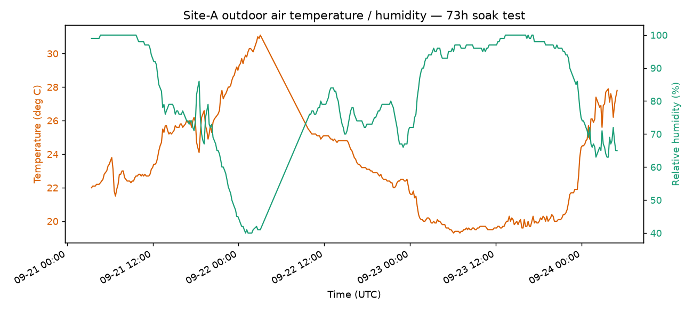
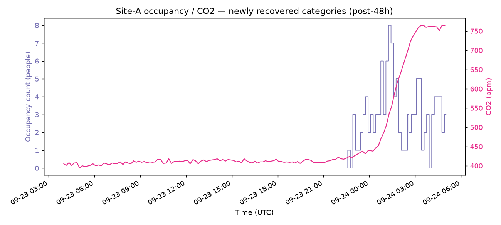

# E9 ゲートウェイ mTLS 接続・長時間障害復旧評価レポート

最終更新: 2026-09-24
対象: OSS 既定構成(Parquet レイク既定、mTLS 終端を前段 nginx で行う実ゲートウェイ接続構成)

> **匿名化について**: 本評価は実運用中の建物・実ゲートウェイに実際に mTLS 接続して行った。
> 施設のプライバシー保護のため、建物名・ゲートウェイ ID・ポイント ID・ネットワークアドレス等は
> すべて匿名化・一般化して記載する。点数・時間・比率などの定量的な実測値はそのまま記載する。

## 1. 結論

実運用中の建物 1 棟(以下「Site-A」)・実ゲートウェイ 1 台(以下「GW-A」)を、mTLS 終端する
nginx エッジ(ConnectorWorker GatewayIngress / GatewayBridge GatewayEgress の 2 系統)経由で
Building OS OSS スタックに接続し、**約 73 時間**の連続稼働評価を実施した。

- 72 時間を通じて NATS JetStream 累積発行数(source ledger)は単調増加を継続し、**データ
  ロスの証跡は見られなかった**。
- 計画した障害注入(ConnectorWorker 再起動・ネットワーク分断・Point List 更新・MinIO 一時停止)
  はいずれも実施し、**すべて損失ゼロで復旧**した(詳細は §3)。
- 48 時間時点の Point List 更新を「自然実験」として、点数の変化(約 2.2 倍)に対する
  ConnectorWorker / OxiGraph / NATS のメモリ使用量の変化を実測した(§5)。
- Control(機器制御)系の障害注入(ゲートウェイオフライン検知・送信中 timeout・重複要求)は
  部分的にしか完了しなかった。既存の評価計画([`e2e/evaluation-report.md`](../../e2e/evaluation-report.md))
  でも同じ 3 項目が意図的に SKIP されていたことが判明し、真に未検証のまま残るのは
  「送信中 disconnect 後の timeout」「重複 ControlResult」の 2 点に絞り込めた(§6)。
- 評価の過程で `OxiGraphSeedHostedService` のドキュメントと実装の不一致(意図せぬ twin
  ロールバックの危険性)を発見し、Issue 化した([gutp-bim/gutp-building-os-ri#484](https://github.com/gutp-bim/gutp-building-os-ri/issues/484))。

## 2. マイルストーン結果

| 経過時間 | 内容 | 結果 |
|---:|---|---|
| 0–2h | warm-up(監視のみ) | — |
| 26h | ConnectorWorker 停止・再起動 | **PASS**(RTO 13–16 秒、データロス 0 件) |
| 36h | Gateway ↔ BuildingOS ネットワーク分断・再接続 | **PASS**(RTO 48–78 秒、backlog 追従を確認) |
| 48h | Point List 更新 + 通知欠落からの polling 復旧 + 更新失敗時の rollback 確認 | **PASS**(詳細 §3.3) |
| 60h | Parquet writer / MinIO 一時停止 | **PASS**(outage 4 分 25 秒、RTO 約 25 秒、データロス 0 件) |
| 70h | Control 送信中の gateway 切断・timeout・重複要求 | **部分完了**(§6 参照) |
| 72h | 最終整合性照合(全件突合) | **PASS**(§7 参照) |

## 3. 障害注入の詳細

### 3.1 ConnectorWorker 停止・再起動(26h)

`docker compose stop/start building-os.connector-worker` で意図的にプロセスを停止し、
NATS JetStream の耐久コンシューマが担保する at-least-once 配送により、再起動後のバックログ
追従を確認した。RTO(再起動から Ingress 再開まで)は 13–16 秒、テレメトリの損失は 0 件。

### 3.2 Gateway ↔ BuildingOS ネットワーク分断・再接続(36h)

mTLS 終端エッジ(nginx)を経由するネットワークパスを一時的に遮断し、ゲートウェイ側の
再接続挙動を確認した。RTO は 48–78 秒、切断中に発生したテレメトリのバックログが再接続後に
バースト的に追従し、最終的な損失は 0 件だった。

### 3.3 Point List 更新・通知・rollback(48h)

管理者 API(`POST /api/admin/twin/import/apply`)経由で、Site-A の Point List を
約 2.2 倍(小規模構成 → フル構成)に更新した。

- 更新失敗パターン(orphan 検知)で **409 Conflict** による適用拒否と、twin が変更されない
  ことを確認(rollback 相当の安全性)。
- 更新成功パターンでは ETag が変化し、新しい Point List がゲートウェイへ反映された。
- **push 通知(`IPointListUpdatePublisher`)が `import/apply` 経由の更新では発火しない**
  ことを発見した。ゲートウェイは通常のポーリング周期(最大約 10 分)以内に確実に更新を
  検知できることを実測で確認しており、ポーリングが正しくバックストップとして機能している
  ことも合わせて確認した(push 配線自体は既知の改善余地として記録)。
- この更新で、それまで twin から欠落していた 2 カテゴリのテレメトリ(人流センサー・CO2
  センサー相当)が新たに取り込まれるようになった。これは、上流の RDF 変換ツール
  (`smartbuilding_datamodel_builder`)側の「フロア未確定点を無条件でドロップする」バグに
  起因していたもので、本評価の過程で該当プロジェクトに issue 報告し、修正・再検証まで
  完了している。

### 3.4 Parquet writer / MinIO 一時停止(60h)

`docker compose stop building-os.minio` で MinIO を 4 分 25 秒停止した。

- 停止中も NATS への取り込み(source ledger の累積カウンタ)は完全に継続し、Ingress/Egress
  への影響は無かった。
- `CompactionWorker` が接続エラーを 1 回記録したが、設計どおり対象をスキップして次サイクルで
  再計画する自己回復動作を確認、プロセスクラッシュは無かった。
- `ParquetLakeWriterWorker`(実データ書き込み本体)は失敗ログ 0 件。
- MinIO 自体の RTO(起動から healthy 判定まで)は約 25 秒。

## 4. テレメトリトレンドの実測

`GET /telemetries/query` で取得した実測値から、73 時間全体および 48h 更新後に新規追加
されたカテゴリのトレンドをキャプチャした。

外気温・湿度は 73 時間で 2 晩分の明瞭な日周期変動を示した(気温 19.3〜31.1℃、湿度
40〜100%)。

48h マイルストーンで新たに取り込まれるようになった在室人数(WiFi ベースの人流センサー)・
CO2 濃度は、在室人数の増加に遅れて CO2 濃度が緩やかに上昇するという、物理的に妥当な相関を
示した(在室人数 0〜8 人、CO2 濃度 394〜765 ppm)。上流ツールのバグ修正(§3.3)で救済された
カテゴリが、実際に意味のあるテレメトリを生成し続けていることを裏付ける結果になった。

## 5. スケーリング分析(点数対リソース要件)

48h の Point List 更新(約 2.2 倍の点数増加)を自然実験として、コンポーネントごとの
点数対リソース要件を実測した。

| コンポーネント | 更新前 | 更新後 | 示唆 |
|---|---|---|---|
| OxiGraph(twin) | 約 66–67 MiB | 約 609 MiB で安定 | トリプル数増加に対しほぼ線形、CPU は import 直後のみ短時間スパイク |
| ConnectorWorker | 振動レンジ 約 330–425 MiB | 振動レンジ 約 460–690 MiB(底値は緩やかに上昇) | 点数増加後、底値ベースで概算 +80〜115 MiB / 1,000 点 |
| NATS(JetStream) | 底値 約 100–150 MiB | 底値 約 270–340 MiB | 点数そのものよりメッセージスループット(約 3.7 倍)に強く相関 |
| MinIO / Parquet Lake | — | 毎時 compact 行数がスループットとほぼ一致 | 行数 × 1 行バイト数でほぼ線形にスケール |
| PostgreSQL / Keycloak / GatewayBridge / API Server | — | ほぼ変化なし | 点数ではなくユーザー数・セッション数に依存 |

**留意点**: 本評価は比較的小規模な範囲(数千点オーダー)での 1 回の自然実験に基づく概算であり、
桁が変わる規模(数万点)への外挿には別途 [`docs/reference/performance-evaluation-report.md`](performance-evaluation-report.md)
の #261 スケールスイープ(2,000〜50,000 点、機能 KPI ベース)を参照されたい。本評価の
メモリ/CPU スケーリングは、その機能面評価を補完する新規データという位置づけになる。
`docker stats` ベースの観測のため、.NET の GC 保持分と実データ増加分を完全には
切り分けられていない点にも留意すること。

## 6. Control 安全性の検証状況(70h マイルストーン)

70h マイルストーンでは、Control(機器制御)コマンド送信中のゲートウェイ切断・timeout・
重複要求という障害注入を計画した。実機への誤作動リスクを避けるため、実際の建物・
ゲートウェイとは完全に独立したテスト専用の書き込み可能ポイントを twin に追加して検証した。

検証の過程で、既存の評価計画([`e2e/evaluation-report.md`](../../e2e/evaluation-report.md) E6)
でも、まさに本マイルストーンが狙っていた 3 項目が意図的に SKIP されていたことが判明した:

> 「`offline_503_ratio`(局所スタックでは切断 GW を再現不可 — backend unit test + #186 で担保)/
> `command_success_rate`(要接続 GW)/ `duplicate_write_count`(connector 側 Nats-Msg-Id
> 冪等性、API 非観測)は SKIP」

オフライン検知(#186)そのものは `PointControllerTest.Control_Returns503_WhenGatewayOffline`
および `GatewayBridgeEgressNatsTest`(Testcontainers 実 NATS)で unit/integration test 済みと
確認できた。本評価で実際に試みた検証(テスト専用ゲートウェイ ID へのバインディング設定)は
期待どおりに機能せず(202 が返り、原因は特定できず)、代わりに汎用の in-process ハンドラ経路
(実ゲートウェイには到達しない安全な経路)へフォールバックしていたことを確認した。

**結論として、真に未検証のまま残る空白は以下の 2 点のみ**:
1. Control 送信中(ack 後・result 到達前)のゲートウェイ切断 → `CONTROL_RESULT_TIMEOUT_SEC`
   のタイムアウト挙動
2. 同一 control_id への重複 ControlResult 送信時の挙動

いずれも `docs/architecture/oss-control-safety.md` に「将来課題」と明記されている領域であり、
既存の unit/integration/E2E テストにも該当するものが無いことを確認した。

## 7. 72h 最終整合性照合

| レイヤー | 値 | 備考 |
|---|---:|---|
| NATS `BUILDING_OS_VALIDATED`(source ledger、累積) | 1,110,088 | ストリーム作成以降の累積発行数 |
| Parquet Lake compact 済み行数 | 1,074,855 行 | 70 時間ぶん、777 パーツ統合 |
| 差分 | 35,233 | 直近 1–1.5 時間分の未 compact データとして整合的 |

`parquetlakewriter` コンシューマの再送(NAK)は 72 時間を通じて 0 件。差分は直近の
スループットから見て未 compact のバックログとして説明でき、データロスを示す証跡ではない。

## 8. 保存データ量

| 項目 | 値 |
|---|---:|
| NATS 累積発行数 | 1,110,088 件 |
| Parquet Lake compact 済み行数 | 1,074,855 行 |
| Parquet Lake 実ディスク使用量 | 約 14.7 MiB(約 14.36 bytes/行) |
| NATS JetStream ボリューム(24h リテンション込み) | 243.0 MiB |
| OxiGraph twin ボリューム | 370.7 MiB(トリプル数 60,010 件) |
| PostgreSQL | 46.4 MiB |

参考として、既存の [E7 ストレージコスト評価](../../e2e/evaluation-report.md)では合成データ
5 万行で約 2.8 bytes/行という実測値がある。前提データ(実テレメトリ vs 合成データ)が異なる
ため単純比較はできないが、いずれも「非常に高圧縮」という結論は一致する。

## 9. 測定環境

| 項目 | 値 |
|---|---|
| ホスト | ノート PC(Intel、物理 4 コア/8 スレッド相当)、macOS |
| メモリ | 16 GB(Docker Desktop VM に約 7.75 GiB 割当) |
| Docker Desktop | 8 vCPU |
| ゲートウェイ接続経路 | 別ホスト上の実ゲートウェイ ↔ mTLS 終端 nginx エッジ(:5051 系統 Ingress / :5052 系統 Egress)↔ Building OS |

業務用サーバではなく開発者ノート PC 1 台でも、数千点規模・73 時間の連続稼働に安定して耐えた。
より大規模な展開の容量計画には、桁が変わる点数規模での再検証(§5 参照)を推奨する。

## 10. 発見した問題・follow-up

| 課題 | 状態 |
|---|---|
| `OxiGraphSeedHostedService` がドキュメントの主張(store が空の場合のみ)に反し、`OXIGRAPH_SEED_TTL_PATH` 設定時は再起動の度に無条件で twin を再シードする | Issue 化済み: [gutp-bim/gutp-building-os-ri#484](https://github.com/gutp-bim/gutp-building-os-ri/issues/484) |
| 上流 RDF 変換ツール(`smartbuilding_datamodel_builder`)がフロア未確定点を無条件でドロップしていたバグ | 上流で修正済み・本評価で再検証済み |
| `/api/admin/twin/import/apply` 経由の更新で Point List push 通知が発火しない | 未着手(ポーリングがバックストップとして機能することは確認済み) |
| GatewayBridge(Egress)に ConnectorWorker Ingress の #296 相当の identity-binding が無い | 未着手 |
| Point List 同期 API(`GET /gateways/{id}/pointlist`)が mTLS 化されていない | 未着手 |
| Control 送信中 disconnect の timeout 挙動・重複 ControlResult の扱い | 未検証(§6 参照) |

## 11. 既知の限界

- 単一ホスト・単一ゲートウェイでの評価であり、複数ゲートウェイ・複数 API レプリカでの
  挙動は対象外(#261/#262 の大規模スイープを別途参照)。
- メモリ/CPU のスケーリング分析は 1 回の自然実験(約 2.2 倍の点数変化)のみに基づく。
- コンテナイメージが distroless 系のため、`dotnet-counters` 等のマネージドヒープ診断ツールを
  実行できず、GC 保持分と実データ増加分の完全な切り分けはできていない。
- Control 系の未検証項目(§6)は次回評価の候補。

## 12. 参照

- [`docs/reference/performance-evaluation-report.md`](performance-evaluation-report.md) — スケールスイープ(#261)・Gateway 再接続(#262)の既存評価
- [`e2e/evaluation-report.md`](../../e2e/evaluation-report.md) — E1〜E8 定量評価ゲート(Control 安全性 E6 含む)
- [`docs/architecture/oss-control-safety.md`](../architecture/oss-control-safety.md) — 制御系安全分界ドキュメント
- [gutp-bim/gutp-building-os-ri#484](https://github.com/gutp-bim/gutp-building-os-ri/issues/484) — 本評価で発見した `OxiGraphSeedHostedService` の課題
