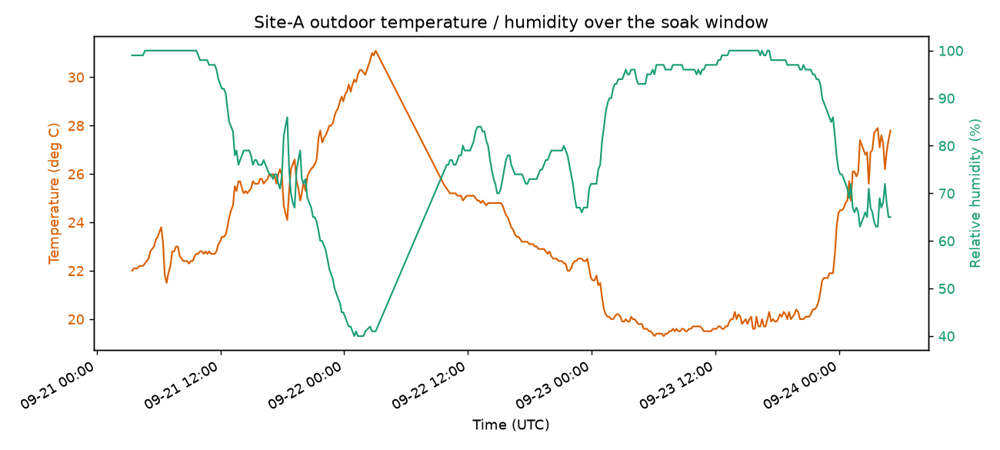
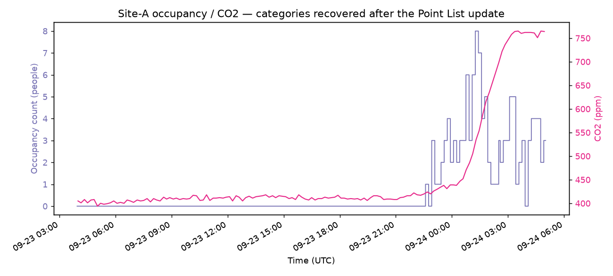

# 実運用ゲートウェイ mTLS 接続・長時間稼働評価レポート

最終更新: 2026-09-24
対象: OSS 既定構成(Parquet レイク既定、mTLS 終端を前段 nginx で行う実ゲートウェイ接続構成)

> **匿名化について**: 本評価は実運用中の建物・実ゲートウェイに実際に mTLS 接続して行った。
> 施設のプライバシー保護のため、建物名・ゲートウェイ ID・ポイント ID・ネットワークアドレス等は
> すべて匿名化・一般化して記載する。点数・時間・比率などの定量的な実測値はそのまま記載する。
> 生の集計 artifact(匿名化済み)は
> [`images/soak-test-artifacts.json`](images/soak-test-artifacts.json) に添付する。

> **命名について**: このリポジトリの `e2e/plan.md` は独自の評価軸番号(E1〜E11)を持ち、
> **E9 は「運用・可観測性(OTel トレース相関)」、E10 が「長時間ソーク(endurance)」**として
> 既に定義されている(`e2e/scenarios/E10-endurance-soak.md`、`s19_endurance_soak.py`)。本評価は
> それらとは別に手動で行ったものであり、混同を避けるため E 番号を付けない。E10 は本評価より
> 厳密な gate 条件(コンテナ再起動 0・OOM 0・loss ≤1%/dup ≤0.5%・health probe ≥99.9%・NATS
> consumer pending の非発散)と、GC 保持分を分離する OTel/Prometheus 計測手段を備えており、
> **本評価はそれを代替するものではなく、実ゲートウェイでの長時間接続という別の条件を補う位置づけ**
> である。

## 1. 結論

実運用中の建物 1 棟(以下「Site-A」)・実ゲートウェイ 1 台(以下「GW-A」)を、mTLS 終端する
nginx エッジ(ConnectorWorker GatewayIngress / GatewayBridge GatewayEgress の 2 系統)経由で
Building OS OSS スタックに接続し、**約 73.6 時間**の連続稼働評価を実施した。

- 72 時間を通じて NATS JetStream 累積発行数(source ledger)は単調増加を継続した。**72h
  時点の最終照合(§7)はサーバ間の累積件数比較であり、個々の sequence 番号や point id を
  突合したものではない**。この範囲において、データ損失を示す証跡は確認されなかった。
- 計画した障害注入(ConnectorWorker 再起動・ネットワーク分断・Point List 更新・MinIO 一時停止)
  はいずれも実施し、観測できた範囲では損失なく復旧した(詳細は §3)。重複の有無についても
  72 時間全件を個別に照合した記録はない(§6 の最終照合と同じ集計ベースの確認に留まる)。
- 48 時間時点の Point List 更新を「自然実験」として、点数の変化(約 2.2 倍)に対する
  ConnectorWorker / OxiGraph / NATS のメモリ使用量の変化を実測した(§5)。メモリはプロセス
  クラッシュ・OOM を起こさず稼働を続けたが、後述のとおり「定常化した」「リークがない」とまでは
  断定できない。
- Control(機器制御)系の障害注入(ゲートウェイオフライン検知・送信中 timeout・重複要求)は
  部分的にしか完了しなかった(§6)。
- 評価の過程で `OxiGraphSeedHostedService` のドキュメントと実装の不一致(意図せぬ twin
  ロールバックの危険性)を発見し、Issue 化した([gutp-bim/gutp-building-os-ri#484](https://github.com/gutp-bim/gutp-building-os-ri/issues/484))。
- 評価に使用した Docker イメージは `main` のコミット `158ec83`(2026-08-28)相当のソースから
  ビルドされたものであり、評価実施時点(2026-09-24)の `main` より約 4 週間古い。ビルド元の
  クローンには複数の未コミットの変更が存在していたことも確認しており、**評価対象コードの
  完全な再現性は保証できない**(§9 参照)。この結果、§3.3 で報告した「push 通知が発火しない」
  という観察は、評価対象イメージにおいては正確だが、`main` では既に `#425` で修正済みである
  ことが事後に判明した(§3.3・§10 参照)。

したがって、本評価は R3(リソース安定性)〜R5(同期の信頼性)の運用適合性を補強する有用な
データを提供するが、**R4 の Control 安全性を含めた完全な運用適合性を証明するものではない**。

## 2. マイルストーン結果

| 経過時間 | 内容 | 結果 |
|---:|---|---|
| 0–2h | warm-up(監視のみ) | — |
| 26h | ConnectorWorker 停止・再起動 | RTO 13–16 秒、観測範囲内でデータ損失なし |
| 36h | Gateway ↔ BuildingOS ネットワーク分断・再接続 | RTO 48–78 秒、backlog 追従を確認 |
| 48h | Point List 更新 + 通知欠落からの polling 復旧 + 更新失敗時の rollback 確認 | 完了(詳細 §3.3) |
| 60h | Parquet writer / MinIO 一時停止 | outage 4 分 25 秒、RTO 約 25 秒、観測範囲内でデータ損失なし |
| 70h | Control 送信中の gateway 切断・timeout・重複要求 | 部分完了(§6 参照) |
| 72h | 最終整合性照合(集計ベース) | 完了(§7 参照) |

## 3. 障害注入の詳細

### 3.1 ConnectorWorker 停止・再起動(26h)

`docker compose stop/start building-os.connector-worker` で意図的にプロセスを停止し、
NATS JetStream の耐久コンシューマが担保する at-least-once 配送により、再起動後のバックログ
追従を確認した。RTO(再起動から Ingress 再開まで)は 13–16 秒、この間のテレメトリの累積件数に
欠落は見られなかった。

### 3.2 Gateway ↔ BuildingOS ネットワーク分断・再接続(36h)

mTLS 終端エッジ(nginx)を経由するネットワークパスを一時的に遮断し、ゲートウェイ側の
再接続挙動を確認した。RTO は 48–78 秒、切断中に発生したテレメトリのバックログが再接続後に
バースト的に追従し、累積件数の欠落は見られなかった。

### 3.3 Point List 更新・通知・rollback(48h)

管理者 API(`POST /api/admin/twin/import/apply`)経由で、Site-A の Point List を
約 2.2 倍(小規模構成 → フル構成)に更新した。

- 更新失敗パターン(orphan 検知)で **409 Conflict** による適用拒否と、twin が変更されない
  ことを確認(rollback 相当の安全性)。
- 更新成功パターンでは ETag が変化し、新しい Point List がゲートウェイへ反映された。
- **評価対象イメージ(§9、`main` 158ec83 相当)では、push 通知(`IPointListUpdatePublisher`)
  が `import/apply` 経由の更新では発火しなかった**。ゲートウェイは通常のポーリング周期
  (最大約 10 分)以内に確実に更新を検知できることを実測で確認しており、ポーリングが
  正しくバックストップとして機能していることも合わせて確認した。**この push 未配線は
  評価実施の約 2 週間前(2026-09-07、`#425`)に `main` で既に修正済みであることが事後の
  確認で判明した**。評価対象イメージが古かったために観測された、既に解消済みの課題である
  (§10 参照)。
- この更新で、それまで twin から欠落していた 2 カテゴリのテレメトリ(人流センサー・CO2
  センサー相当)が新たに取り込まれるようになった。これは、上流の RDF 変換ツール
  (`smartbuilding_datamodel_builder`)側の「フロア未確定点を無条件でドロップする」バグに
  起因していたもので、本評価の過程で該当プロジェクトに issue 報告し、修正・再検証まで
  完了している。

### 3.4 Parquet writer / MinIO 一時停止(60h)

`docker compose stop building-os.minio` で MinIO を 4 分 25 秒停止した。

- 停止中も NATS への取り込み(source ledger の累積カウンタ)は継続し、Ingress/Egress
  への影響は観測されなかった。
- `CompactionWorker` が接続エラーを 1 回記録したが、設計どおり対象をスキップして次サイクルで
  再計画する自己回復動作を確認、プロセスクラッシュは無かった。
- `ParquetLakeWriterWorker`(実データ書き込み本体)は失敗ログ 0 件。
- MinIO 自体の RTO(起動から healthy 判定まで)は約 25 秒。

## 4. テレメトリトレンドの実測

`GET /telemetries/query` で取得した実測値から、73 時間全体および 48h 更新後に新規追加
されたカテゴリのトレンドをキャプチャした。

外気温・湿度は 73 時間で 2 晩分の明瞭な日周期変動を示した(気温 19.3〜31.1℃、湿度
40〜100%)。

48h マイルストーンで新たに取り込まれるようになった在室人数(WiFi ベースの人流センサー)・
CO2 濃度は、在室人数の増加に遅れて CO2 濃度が緩やかに上昇するという、物理的に妥当な相関を
示した(在室人数 0〜8 人、CO2 濃度 394〜765 ppm)。上流ツールのバグ修正(§3.3)で救済された
カテゴリが、実際に意味のあるテレメトリを生成し続けていることを裏付ける結果になった。

## 5. スケーリング分析(点数対リソース要件)

48h の Point List 更新(約 2.2 倍の点数増加)を自然実験として、コンポーネントごとの
点数対リソース要件を実測した。

| コンポーネント | 更新前 | 更新後 | 示唆 |
|---|---|---|---|
| OxiGraph(twin) | 約 66–67 MiB | 約 609 MiB で安定 | トリプル数増加に対しほぼ線形、CPU は import 直後のみ短時間スパイク |
| ConnectorWorker | 振動レンジ 約 330–425 MiB | 振動レンジ 約 460–690 MiB(底値は緩やかに上昇) | 点数増加後、底値ベースで概算 +80〜115 MiB / 1,000 点 |
| NATS(JetStream) | 底値 約 100–150 MiB | 底値 約 270–340 MiB | 点数そのものよりメッセージスループット(約 3.7 倍)に強く相関 |
| MinIO / Parquet Lake | — | 毎時 compact 行数がスループットとほぼ一致 | 行数 × 1 行バイト数でほぼ線形にスケール |
| PostgreSQL / Keycloak / GatewayBridge / API Server | — | ほぼ変化なし | 点数ではなくユーザー数・セッション数に依存 |

**留意点**: 本評価は比較的小規模な範囲(数千点オーダー)での 1 回の自然実験に基づく概算であり、
桁が変わる規模(数万点)への外挿には別途 [`docs/reference/performance-evaluation-report.md`](performance-evaluation-report.md)
の #261 スケールスイープ(2,000〜50,000 点、機能 KPI ベース)を参照されたい。本評価の
メモリ/CPU スケーリングは、その機能面評価を補完する新規データという位置づけになる。

**メモリの「安定化」は未確定**: `docker stats` はコンテナの cgroup ワーキングセット(managed
heap + native 割当 + GC が OS に返していない領域 + page cache が混在した 1 つの数値)であり、
.NET の GC 保持分と実データ増加分を分離できない。ConnectorWorker は点数増加後、約
460〜690 MiB のレンジで大きな下降サイクルを繰り返し観測できた(振動していることは確認できた)
一方、レンジの底値自体は緩やかに上昇する傾向も見られた。**プロセスクラッシュや OOM が
無かったことは確認できるが、これをもって「メモリ使用量が定常化した」「リークがない」と
断定することはできない**。このリポジトリの `e2e/scenarios/E10-endurance-soak.md`(#370)は、
OTel の `.AddRuntimeInstrumentation()` と Prometheus を用いて RSS から GC committed 分を
分離する具体的な方法を既に文書化しているが、本評価ではその手段を用いていない。

## 6. Control 安全性の検証状況(70h マイルストーン)

70h マイルストーンでは、Control(機器制御)コマンド送信中のゲートウェイ切断・timeout・
重複要求という障害注入を計画した。実機への誤作動リスクを避けるため、実際の建物・
ゲートウェイとは完全に独立したテスト専用の書き込み可能ポイントを twin に追加して検証した。

検証の過程で、既存の評価計画([`e2e/evaluation-report.md`](../../e2e/evaluation-report.md) E6)
でも、まさに本マイルストーンが狙っていた 3 項目が意図的に SKIP されていたことが判明した:

> 「`offline_503_ratio`(局所スタックでは切断 GW を再現不可 — backend unit test + #186 で担保)/
> `command_success_rate`(要接続 GW)/ `duplicate_write_count`(connector 側 Nats-Msg-Id
> 冪等性、API 非観測)は SKIP」

オフライン検知(#186)そのものは `PointControllerTest.Control_Returns503_WhenGatewayOffline`
および `GatewayBridgeEgressNatsTest`(Testcontainers 実 NATS)で unit/integration test 済みと
確認できた。本評価で実際に試みた検証(テスト専用ゲートウェイ ID へのバインディング設定)は
期待どおりに機能せず(202 が返り、原因は特定できず)、代わりに汎用の in-process ハンドラ経路
(実ゲートウェイには到達しない安全な経路)へフォールバックしていたことを確認した。

**真に未検証のまま残る Control 系の空白**(既存テストにも該当するものが無いことを確認済み、
`docs/architecture/oss-control-safety.md` にも「将来課題」と明記されている):
1. Control 送信中(ack 後・result 到達前)のゲートウェイ切断 → `CONTROL_RESULT_TIMEOUT_SEC`
   のタイムアウト挙動
2. 同一 control_id への重複 ControlResult 送信時の挙動

これに加え、本評価は**単一ゲートウェイ・単一 API レプリカ構成でのみ**行っており、複数
ゲートウェイ・複数レプリカ環境での Control 安全性(#186 のオフライン検知が複数レプリカ間で
一貫するか等)も範囲外である。

## 7. 72h 最終整合性照合(集計ベース)

| レイヤー | 値 | 備考 |
|---|---:|---|
| NATS `BUILDING_OS_VALIDATED`(source ledger、累積) | 1,110,088 | ストリーム作成以降の累積発行数 |
| Parquet Lake compact 済み行数 | 1,074,855 行 | 70 時間ぶん、777 パーツ統合 |
| 差分 | 35,233 | 直近 1–1.5 時間分の未 compact データとして説明可能な範囲 |

`parquetlakewriter` コンシューマの再送(NAK)は 72 時間を通じて 0 件。

**この照合は累積件数の集計比較であり、個々の sequence 番号や point id を NATS / Hot KV /
Parquet Lake の 3 層で突合したものではない**。したがって「データ損失を示す証跡は確認
されなかった」という以上の主張(完全性の証明、重複の不在の証明)はできない。全ポイント
単位の end-to-end 完全照合は今回実施していない(§10 参照)。

## 8. 保存データ量

| 項目 | 値 |
|---|---:|
| NATS 累積発行数 | 1,110,088 件 |
| Parquet Lake compact 済み行数 | 1,074,855 行 |
| Parquet Lake 実ディスク使用量 | 約 14.7 MiB(約 14.36 bytes/行) |
| NATS JetStream ボリューム(24h リテンション込み) | 243.0 MiB |
| OxiGraph twin ボリューム | 370.7 MiB(トリプル数 60,010 件) |
| PostgreSQL | 46.4 MiB |

参考として、既存の [E7 ストレージコスト評価](../../e2e/evaluation-report.md)では合成データ
5 万行で約 2.8 bytes/行という実測値がある。前提データ(実テレメトリ vs 合成データ)が異なる
ため単純比較はできないが、いずれも「非常に高圧縮」という結論は一致する。

## 9. 測定環境・評価対象コード

| 項目 | 値 |
|---|---|
| ホスト | ノート PC(Intel、物理 4 コア/8 スレッド相当)、macOS |
| メモリ | 16 GB(Docker Desktop VM に約 7.75 GiB 割当) |
| Docker Desktop | 8 vCPU |
| ゲートウェイ接続経路 | 別ホスト上の実ゲートウェイ ↔ mTLS 終端 nginx エッジ(:5051 系統 Ingress / :5052 系統 Egress)↔ Building OS |

**評価対象コード**: 使用した Docker イメージは `main` のコミット
[`158ec83`](https://github.com/gutp-bim/gutp-building-os-ri/commit/158ec83542196acdcc26603725cdae76410a3567)
(2026-08-28)相当のソースからビルドされ、イメージのビルド日時は 2026-09-09 だった。評価実施
(2026-09-21〜24)時点の `main` より約 3〜4 週間古い。**ビルド元のクローンには複数の
未コミットの変更(diff)が存在していたことも確認しており、評価対象コードの完全な
再現性は保証できない**。詳細な image ID・既知の drift(§3.3 の push 通知修正を含む)は
[`images/soak-test-artifacts.json`](images/soak-test-artifacts.json) に記録した。

業務用サーバではなく開発者ノート PC 1 台でも、数千点規模・73 時間の連続稼働に安定して耐えた
(観測できた範囲では)。より大規模な展開の容量計画には、桁が変わる点数規模での再検証(§5 参照)
を推奨する。

## 10. 発見した問題・follow-up

| 課題 | 状態 |
|---|---|
| `OxiGraphSeedHostedService` がドキュメントの主張(store が空の場合のみ)に反し、`OXIGRAPH_SEED_TTL_PATH` 設定時は再起動の度に無条件で twin を再シードする | Issue 化済み: [gutp-bim/gutp-building-os-ri#484](https://github.com/gutp-bim/gutp-building-os-ri/issues/484) |
| 上流 RDF 変換ツール(`smartbuilding_datamodel_builder`)がフロア未確定点を無条件でドロップしていたバグ | 上流で修正済み・本評価で再検証済み |
| `/api/admin/twin/import/apply` 経由の更新で Point List push 通知が発火しない | **評価対象イメージでは未発火だったが、`main` では `#425`(2026-09-07 マージ)で既に修正済み。評価対象イメージが古かったための誤検出** |
| GatewayBridge(Egress)に ConnectorWorker Ingress の #296 相当の identity-binding が無い | 現行 `main` での状態は未再確認(本評価は古いイメージで実施) |
| Point List 同期 API(`GET /gateways/{id}/pointlist`)が mTLS 化されていない | 現行 `main` での状態は未再確認(本評価は古いイメージで実施) |
| Control 送信中 disconnect の timeout 挙動・重複 ControlResult の扱い | 未検証(§6 参照) |

## 11. 既知の限界

- **評価対象コードが `main` の HEAD ではなく約 3〜4 週間古いコミット相当**であり、その間に
  マージされた修正(§3.3・§10 参照)を反映していない。本評価で「未実装」と報告した項目のうち
  一部は既に現行 `main` で解消済みの可能性がある。
- 単一ホスト・単一ゲートウェイ・単一 API レプリカでの評価であり、複数ゲートウェイ・複数
  レプリカでの挙動は対象外(#261/#262 の大規模スイープを別途参照)。
- メモリ/CPU のスケーリング分析は 1 回の自然実験(約 2.2 倍の点数変化)のみに基づく。
  数万点規模との組み合わせ、複数日規模との組み合わせは未実施。
- `docker stats` ベースの観測のため、.NET の GC 保持分(managed heap)と実データ増加分・
  page cache を分離できておらず、「メモリが定常化した」「リークがない」とは断定できない
  (§5 参照、`e2e/scenarios/E10-endurance-soak.md` #370 に分離手法の記載あり)。
- 72h 最終整合性照合は累積件数の集計比較であり、sequence 番号 / point id 単位の全件照合では
  ない(§7 参照)。重複の有無についても全件照合していない。
- Control 系の未検証項目(§6)は次回評価の候補。

## 12. 参照

- [`docs/reference/performance-evaluation-report.md`](performance-evaluation-report.md) — スケールスイープ(#261)・Gateway 再接続(#262)の既存評価
- [`e2e/evaluation-report.md`](../../e2e/evaluation-report.md) — E1〜E8 定量評価ゲート(Control 安全性 E6 含む)
- [`e2e/plan.md`](../../e2e/plan.md) — このリポジトリの E1〜E11 評価軸の定義(E9=運用・可観測性、E10=長時間ソーク)
- [`e2e/scenarios/E10-endurance-soak.md`](../../e2e/scenarios/E10-endurance-soak.md) — 本評価と別に、より厳密な gate 条件と GC 分離計測手段を備えた長時間ソーク軸
- [`docs/architecture/oss-control-safety.md`](../architecture/oss-control-safety.md) — 制御系安全分界ドキュメント
- [gutp-bim/gutp-building-os-ri#484](https://github.com/gutp-bim/gutp-building-os-ri/issues/484) — 本評価で発見した `OxiGraphSeedHostedService` の課題
- [`images/soak-test-artifacts.json`](images/soak-test-artifacts.json) — 匿名化した集計 artifact(マイルストーン・照合結果・評価対象イメージ情報)
