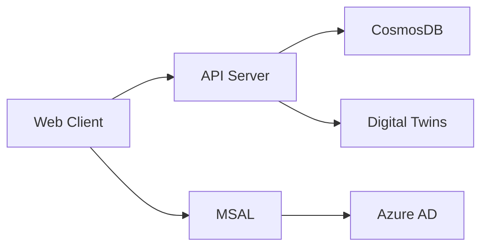

# Building OS Web Client

> Building OS のフロントエンドアプリケーション

Next.js、TypeScript、Tailwind CSS を使用したモダンな Web クライアントです。ビル設備の監視・制御、テレメトリデータの可視化を提供します。

## 🚀 技術スタック

### コアフレームワーク

- **Next.js 16**: React ベースのフルスタックフレームワーク（App Router）
- **React 19**: UI ライブラリ
- **TypeScript 5**: 型安全な開発

### スタイリング

- **Tailwind CSS 4**: ユーティリティファーストCSS
- **Radix UI**: アクセシブルなUIコンポーネント群
- **Lucide React**: アイコンライブラリ

### 認証

- **MSAL (Microsoft Authentication Library)**: Azure AD 認証
- **@azure/msal-react**: React 統合

### API 通信

- **Aspida**: 型安全な API クライアント（OpenAPI スキーマから生成、内部で axios 使用）

### UI コンポーネント

- **React Hook Form**: フォーム管理
- **Recharts**: データ可視化・グラフ描画
- **date-fns**: 日付操作
- **Sonner**: トースト通知

## 📁 プロジェクト構成

```
src/
├── app/                    # Next.js App Router
│   ├── (auth)/            # 認証ページ
│   │   └── sign-in/       # サインインページ
│   ├── (protected)/       # 認証保護ページ
│   │   └── buildings/     # ビル管理ページ
│   ├── layout.tsx         # ルートレイアウト
│   └── page.tsx           # ホームページ
├── components/            # 共有コンポーネント
│   └── table/            # テーブル関連コンポーネント
├── contexts/             # React Context
│   └── TableContext.tsx  # テーブル状態管理
├── lib/                  # ライブラリ・ユーティリティ
│   ├── auth/            # 認証関連
│   ├── infra/           # インフラ層
│   │   ├── api-client/  # API クライアント
│   │   └── aspida-client/  # Aspida 生成コード
│   └── utils/           # ユーティリティ関数
├── middleware.ts        # Next.js ミドルウェア
└── types/              # TypeScript 型定義
```

## 🛠️ 開発環境のセットアップ

### 前提条件

- Node.js 20.x 以上
- Yarn パッケージマネージャー

### インストール

```bash
# 依存関係のインストール
yarn install
```

### 環境変数の設定

`.env.local` ファイルを作成し、以下を設定します：

```bash
# API エンドポイント
NEXT_PUBLIC_API_BASE_URL=http://localhost:5000

# Azure AD 認証
NEXT_PUBLIC_AZURE_CLIENT_ID=your-client-id
NEXT_PUBLIC_AZURE_TENANT_ID=your-tenant-id
NEXT_PUBLIC_MSAL_TOKEN_SCOPE=api://your-api-scope/.default
```

### 開発サーバーの起動

```bash
# 標準起動
yarn dev

# eng2 環境での起動
yarn dev:eng2
```

ブラウザで [http://localhost:3000](http://localhost:3000) にアクセスしてください。

## 📝 スクリプト

```bash
# 開発サーバー起動（Turbopack 有効）
yarn dev

# eng2 環境で開発サーバー起動
yarn dev:eng2

# 本番ビルド
yarn build

# 本番サーバー起動
yarn start

# ESLint チェック
yarn lint

# コードフォーマットチェック
yarn format:check

# コードフォーマット適用
yarn format:write

# 型チェック
yarn typecheck
```

## 🏗️ アーキテクチャ

### ページ構成

#### 認証フロー

```mermaid
graph LR
    A[/ Root] --> B{認証済み?}
    B -->|No| C[/sign-in]
    B -->|Yes| D[/buildings]
    C --> E[Azure AD Login]
    E --> D
```

#### ルーティング

- `/`: ルートページ（認証後は `/buildings` へリダイレクト）
- `/sign-in`: サインインページ
- `/buildings`: ビル一覧
- `/buildings/[buildingId]`: ビル詳細・デバイス一覧
- `/buildings/[buildingId]/[deviceId]`: デバイス詳細・ポイント一覧
- `/buildings/[buildingId]/[deviceId]/[pointId]`: ポイント詳細・制御

### データフロー



### 状態管理

- **認証状態**: MSAL Context
- **API データ**: Server Components + Client Hooks
- **ローカル状態**: React State / Context API
- **フォーム**: React Hook Form

## 🎨 UI コンポーネント

### Radix UI ベースコンポーネント

プロジェクトでは以下の Radix UI コンポーネントを使用：

- Accordion, Alert Dialog, Avatar, Checkbox
- Dialog, Dropdown Menu, Hover Card, Popover
- Select, Slider, Switch, Tabs, Toast
- など多数

カスタムコンポーネントは `src/components/` 配下に配置しています。

## 🧪 テスト

```bash
# 型チェック
yarn typecheck

# Linter 実行
yarn lint
```

## 📦 ビルド

### 本番ビルド

```bash
yarn build
```

ビルド成果物は `.next/standalone/` ディレクトリに生成されます。

### Docker イメージビルド

```dockerfile
FROM node:20-alpine AS builder
WORKDIR /app
COPY package.json yarn.lock ./
RUN yarn install --frozen-lockfile
COPY . .
RUN yarn build

FROM node:20-alpine AS runner
WORKDIR /app
COPY --from=builder /app/.next/standalone ./
COPY --from=builder /app/.next/static ./.next/static
COPY --from=builder /app/public ./public
EXPOSE 3000
CMD ["node", "server.js"]
```

## 🔒 認証

### MSAL 設定

Azure AD 認証は MSAL (Microsoft Authentication Library) で実装されています。

```typescript
// lib/auth/msal-config.ts
export const msalConfig = {
  auth: {
    clientId: process.env.NEXT_PUBLIC_AZURE_CLIENT_ID!,
    authority: `https://login.microsoftonline.com/${process.env.NEXT_PUBLIC_AZURE_TENANT_ID}`,
    redirectUri: window.location.origin,
  },
};
```

### 認証フロー

1. ユーザーが保護されたページにアクセス
2. 未認証の場合、`/sign-in` へリダイレクト
3. Azure AD でログイン
4. トークン取得後、元のページへリダイレクト

## 📡 API 通信

### Aspida による型安全な API クライアント

```typescript
import { apiClient } from "@/lib/infra/aspida-client";

// 型安全な API 呼び出し
const buildings = await apiClient.buildings.$get();
const building = await apiClient.buildings
  ._buildingDtId(buildingId)
  .$get();
```

### API クライアント生成

OpenAPI スキーマから自動生成されたクライアントを使用しています。

## 🎯 主要機能

### ビル管理

- ビル一覧表示
- ビル詳細表示
- フロア・スペース階層表示

### デバイス管理

- デバイス一覧表示（テーブル）
- デバイス詳細表示
- フィルタ・ソート・ページネーション

### ポイント管理

- ポイント一覧表示
- ポイント詳細表示
- リアルタイムテレメトリ表示

### デバイス制御

- Analog Output 制御
- Binary Output 制御
- Multi-State Output 制御

### テレメトリ表示

- **ウォームデータ**: 直近のデータ（CosmosDB）
- **コールドデータ**: 長期保存データのダウンロード（Blob Storage）

## 🎨 スタイリング

### Tailwind CSS 設定

Tailwind CSS v4 を使用しており、`postcss.config.mjs` で `@tailwindcss/postcss` プラグインを設定しています。グローバルなカラー設定は `src/app/globals.css` の CSS カスタムプロパティで定義されています(現状は**ライトテーマ固定** — `dark:` バリアント未対応のため、フルダークモード対応はデザイントークン接続込みで将来対応。#118 参照)。

## 🚧 既知の問題

現在、既知の大きな問題はありません。

## 📚 参考リソース

- [Next.js ドキュメント](https://nextjs.org/docs)
- [React ドキュメント](https://react.dev/)
- [Tailwind CSS ドキュメント](https://tailwindcss.com/docs)
- [Radix UI ドキュメント](https://www.radix-ui.com/docs/primitives/overview/introduction)
- [MSAL.js ドキュメント](https://github.com/AzureAD/microsoft-authentication-library-for-js)

## 🤝 コントリビューション

プルリクエストを歓迎します。大きな変更の場合は、まず Issue を作成して変更内容を議論してください。
